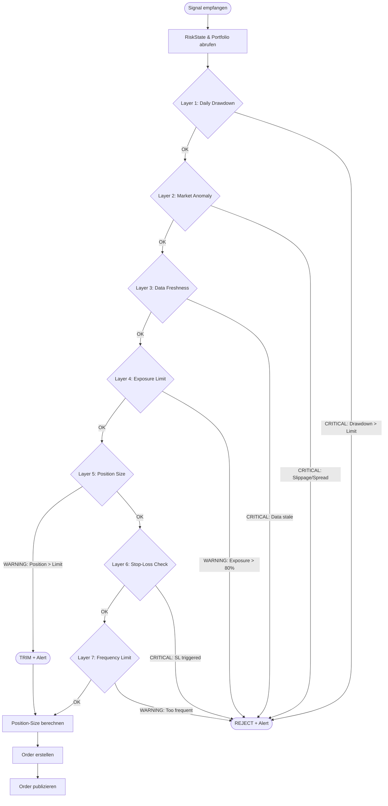

# Risk-Engine Spezifikation V1.0

**Projekt:** Claire de Binaire
**Version:** 1.0
**Status:** Canonical Specification
**Letzte Aktualisierung:** 2025-11-21

---

## Inhaltsverzeichnis

1. [Executive Summary](#1-executive-summary)
2. [Systemkontext](#2-systemkontext)
3. [Prozessfluss: Signal → Risk → Entscheidung](#3-prozessfluss-signal--risk--entscheidung)
4. [Schutzschichten (7 Layers)](#4-schutzschichten-7-layers)
5. [Risk-Parameter](#5-risk-parameter)
6. [Alert-Codes & Severity](#6-alert-codes--severity)
7. [Beispiel-Flows](#7-beispiel-flows)
8. [Pseudocode-Spezifikation](#8-pseudocode-spezifikation)
9. [State Management](#9-state-management)
10. [Recovery-Verhalten](#10-recovery-verhalten)

---

## 1. Executive Summary

Die **Risk-Engine** ist das zentrale Schutzsystem von Claire de Binaire. Sie validiert alle Trading-Signale gegen eine **7-Schichten-Architektur** priorisierter Risikoregeln, bevor Orders zur Ausführung freigegeben werden.

**Kernprinzipien:**
- **Capital Preservation > Profit** – Im Zweifel ablehnen, nicht trimmen
- **Deterministische Entscheidungen** – Alle Regeln sind ENV-parametrisiert und dokumentiert
- **Sequential Layer Validation** – Jedes Signal durchläuft alle Layers in fester Reihenfolge
- **Transparent & Auditierbar** – Jede Entscheidung wird mit Reason-Code geloggt

**Eingaben:**
- `StrategySignal` (von Signal-Engine)
- `RiskState` (aktueller Systemzustand)
- `PortfolioSnapshot` (Positionen, Exposure)
- `RiskConfig` (ENV-Parameter)

**Ausgaben:**
- `RiskDecision` (approved/rejected, Größe, Reason-Code)
- `Alert` (bei Limit-Verletzungen)

---

## 2. Systemkontext

### 2.1 Event-Flow Integration

```
┌────────────────┐
│ Signal-Engine  │ (port 8001)
└────────┬───────┘
         │ publishes: signals
         ↓
┌────────────────┐
│  Risk-Manager  │ (port 8002) ← DIESE SPEZIFIKATION
└────────┬───────┘
         │ publishes: orders (approved)
         │ publishes: alerts (violations)
         ↓
┌────────────────┐
│ Execution Svc  │ (port 8003)
└────────────────┘
```

### 2.2 Input: StrategySignal

```json
{
  "type": "signal",
  "symbol": "BTC_USDT",
  "side": "BUY" | "SELL",
  "confidence": 0.82,        // 0.0 - 1.0
  "reason": "MOMENTUM_BREAKOUT",
  "price": 35250.5,
  "pct_change": 0.024,       // 2.4% Momentum
  "timestamp": 1730443260000
}
```

### 2.3 Output: RiskDecision (logisch)

```json
{
  "type": "risk_decision",
  "approved": true | false,
  "symbol": "BTC_USDT",
  "requested_direction": "BUY",
  "approved_size": 0.05,     // null wenn rejected
  "reason_code": "OK" | "DRAWDOWN_LIMIT" | "EXPOSURE_LIMIT" | ...,
  "layer_results": {         // Alle Layer-Checks (für Audit)
    "daily_drawdown": {"passed": true, "value": -0.02},
    "market_anomaly": {"passed": true, "slippage": 0.005},
    "data_freshness": {"passed": true, "age_seconds": 12},
    "exposure_limit": {"passed": true, "current_pct": 0.25},
    "position_limit": {"passed": true, "trimmed": false},
    "stop_loss": {"passed": true}
  },
  "timestamp": 1730443270000
}
```

### 2.4 Output: Alert (bei Violations)

```json
{
  "type": "alert",
  "level": "CRITICAL" | "WARNING" | "INFO",
  "code": "RISK_LIMIT" | "CIRCUIT_BREAKER" | "DATA_STALE" | "EXECUTION_ERROR",
  "message": "Daily Drawdown erreicht: -5.2% (Limit: -5.0%)",
  "context": {
    "signal": "BTC_USDT",
    "layer": "daily_drawdown",
    "current_value": -0.052,
    "limit_value": -0.05
  },
  "timestamp": 1730443270000
}
```

---

## 3. Prozessfluss: Signal → Risk → Entscheidung

### 3.1 Textueller Ablauf

1. **Signal empfangen** (via Redis Topic `signals`)
2. **State abrufen** (RiskState, PortfolioSnapshot)
3. **Layer-Validierung** (sequenziell durch alle 7 Layers)
   - **Bei CRITICAL-Verletzung**: sofort ablehnen, Alert senden, return
   - **Bei WARNING-Verletzung**: trimmen oder pausieren, Alert senden
   - **Bei OK**: nächster Layer
4. **Position-Size berechnen** (basierend auf Confidence & Limits)
5. **Order erstellen** (falls approved)
6. **Order publizieren** (via Redis Topic `orders`)
7. **State aktualisieren** (pending_orders++)

### 3.2 Mermaid Flow-Diagramm



---

## 4. Schutzschichten (7 Layers)

### Layer-Übersicht (Priorität & Implementierungsstatus)

| # | Layer | Severity | Aktion | ENV-Parameter | Status |
|---|-------|----------|--------|---------------|--------|
| 1 | Daily Drawdown | CRITICAL | Trading-Stopp | `MAX_DAILY_DRAWDOWN_PCT` | ✅ Implementiert |
| 2 | Market Anomaly | CRITICAL | Circuit Breaker | `MAX_SLIPPAGE_PCT`, `MAX_SPREAD_MULTIPLIER` | ⚠️ Spec only |
| 3 | Data Freshness | CRITICAL | Pause neue Orders | `DATA_STALE_TIMEOUT_SEC` | ⚠️ Spec only |
| 4 | Exposure Limit | WARNING | Blockieren | `MAX_EXPOSURE_PCT` | ✅ Implementiert |
| 5 | Position Size | WARNING | Trimmen | `MAX_POSITION_PCT` | ✅ Implementiert |
| 6 | Stop-Loss | CRITICAL | Auto-Exit | `STOP_LOSS_PCT` | ⚠️ Config only |
| 7 | Frequency Limit | WARNING | Rate-Limiting | `MAX_TRADES_PER_HOUR` | ⚠️ Spec only |

---

### Layer 1: Daily Drawdown (Circuit Breaker)

**Zweck:** Systemweiter Trading-Stopp bei Überschreitung des Tagesverlusts
**Severity:** CRITICAL
**Trigger:** `daily_pnl <= -(test_balance * MAX_DAILY_DRAWDOWN_PCT)`
**Aktion:**
1. Setze `circuit_breaker_active = true`
2. Blockiere ALLE neuen Signale
3. Sende CRITICAL Alert `CIRCUIT_BREAKER`
4. (Optional) Schließe alle offenen Positionen

**Recovery:**
- Reset um 00:00 UTC (`daily_pnl = 0`)
- ODER manuelle Freigabe via Admin-Befehl

**ENV-Parameter:**
- `MAX_DAILY_DRAWDOWN_PCT` (default: 0.05 = 5%)

**Beispiel:**
```python
# Kapital: 10.000 USD
# MAX_DAILY_DRAWDOWN_PCT: 0.05 (5%)
# daily_pnl: -520 USD (-5.2%)

if daily_pnl <= -(10000 * 0.05):  # -520 <= -500
    circuit_breaker_active = True
    return REJECT("CIRCUIT_BREAKER", "Daily Drawdown: -5.2% (Limit: -5.0%)")
```

---

### Layer 2: Market Anomaly Detection

**Zweck:** Schutz vor illiquiden Märkten und Flash-Crashes
**Severity:** CRITICAL
**Trigger:**
- Slippage > `MAX_SLIPPAGE_PCT` (z.B. 1%)
- Bid-Ask-Spread > `MAX_SPREAD_MULTIPLIER` * Normal-Spread (z.B. 5x)
- Volume < `MIN_VOLUME_THRESHOLD` (optional)

**Aktion:**
1. Blockiere neue Orders für Symbol
2. Sende WARNING Alert `CIRCUIT_BREAKER`
3. Retry alle 60s (max. 10 Versuche)

**Recovery:**
- Automatisch bei Normalisierung der Marktdaten

**ENV-Parameter:**
- `MAX_SLIPPAGE_PCT` (default: 0.01 = 1%)
- `MAX_SPREAD_MULTIPLIER` (default: 5.0)
- `MIN_VOLUME_THRESHOLD` (optional)

**Pseudocode:**
```python
def check_market_anomaly(signal, market_data):
    slippage = abs(signal.price - market_data.last_price) / market_data.last_price
    if slippage > MAX_SLIPPAGE_PCT:
        return REJECT("CIRCUIT_BREAKER", f"High slippage: {slippage*100:.1f}%")

    spread = (market_data.ask - market_data.bid) / market_data.mid
    normal_spread = get_average_spread(signal.symbol, lookback_hours=24)
    if spread > normal_spread * MAX_SPREAD_MULTIPLIER:
        return REJECT("CIRCUIT_BREAKER", f"Spread anomaly: {spread:.4f} (normal: {normal_spread:.4f})")

    return OK
```

---

### Layer 3: Data Freshness

**Zweck:** Verhindern von Trades auf veralteten Daten
**Severity:** CRITICAL
**Trigger:** `time.now() - last_market_data.timestamp > DATA_STALE_TIMEOUT_SEC`

**Aktion:**
1. Pausiere neue Orders (bestehende Positionen halten)
2. Sende WARNING Alert `DATA_STALE`
3. Warte auf neues `market_data` Event

**Recovery:**
- Automatisch bei Empfang neuer Marktdaten

**ENV-Parameter:**
- `DATA_STALE_TIMEOUT_SEC` (default: 30)

**Pseudocode:**
```python
def check_data_freshness(signal):
    age_seconds = time.now() - last_market_data_timestamp
    if age_seconds > DATA_STALE_TIMEOUT_SEC:
        return REJECT("DATA_STALE", f"Market data stale: {age_seconds}s (limit: {DATA_STALE_TIMEOUT_SEC}s)")
    return OK
```

---

### Layer 4: Portfolio Exposure Limit

**Zweck:** Begrenzung des Gesamt-Risikos über alle Positionen
**Severity:** WARNING (>50%), CRITICAL (>80%)
**Trigger:** `total_exposure >= test_balance * MAX_EXPOSURE_PCT`

**Berechnung:**
```python
total_exposure = sum(
    abs(qty) * last_price
    for symbol, qty in positions.items()
)
```

**Aktion:**
- **Bei >50% (Limit)**: Blockiere neue Orders
- **Bei >80%**: CRITICAL Alert + erzwinge Position-Reduzierung

**ENV-Parameter:**
- `MAX_EXPOSURE_PCT` (default: 0.50 = 50%)

**Pseudocode:**
```python
def check_exposure_limit():
    total_exposure = sum(abs(qty) * last_prices.get(sym, 0)
                        for sym, qty in positions.items())

    max_exposure = test_balance * MAX_EXPOSURE_PCT

    if total_exposure >= max_exposure:
        level = "CRITICAL" if total_exposure > max_exposure * 0.8 else "WARNING"
        return REJECT("RISK_LIMIT", f"Max Exposure: {total_exposure:.0f} >= {max_exposure:.0f}", level)

    return OK
```

---

### Layer 5: Position Size Limit

**Zweck:** Diversifikation – Keine Single Position > 10% des Kapitals
**Severity:** WARNING
**Trigger:** `position_value > test_balance * MAX_POSITION_PCT`

**Aktion:**
1. **Trimmen** (nicht ablehnen!) – reduziere auf MAX_POSITION_PCT
2. Sende WARNING Alert `RISK_LIMIT`

**ENV-Parameter:**
- `MAX_POSITION_PCT` (default: 0.10 = 10%)

**Pseudocode:**
```python
def check_position_limit(signal):
    max_position_size = test_balance * MAX_POSITION_PCT

    # Confidence-basierte Größe (Signal-Engine schlägt vor)
    requested_size = max_position_size * signal.confidence

    if requested_size > max_position_size:
        # TRIM statt REJECT
        approved_size = max_position_size
        send_alert("WARNING", "RISK_LIMIT", f"Position trimmed: {signal.symbol} {requested_size:.4f} → {approved_size:.4f}")
        return TRIM(approved_size)

    return OK(requested_size)
```

---

### Layer 6: Stop-Loss Check

**Zweck:** Automatischer Exit bei Verlust > Stop-Loss pro Position
**Severity:** CRITICAL
**Trigger:** `position_loss >= position_value * STOP_LOSS_PCT`

**Berechnung:**
```python
position_loss = (entry_price - current_price) / entry_price  # für LONG
position_loss = (current_price - entry_price) / entry_price  # für SHORT
```

**Aktion:**
1. Generiere SELL-Order (bei LONG) bzw. BUY-Order (bei SHORT)
2. Sende WARNING Alert `RISK_LIMIT`

**ENV-Parameter:**
- `STOP_LOSS_PCT` (default: 0.02 = 2%)

**Pseudocode:**
```python
def check_stop_loss_triggered(positions, current_prices):
    for symbol, position in positions.items():
        current_price = current_prices.get(symbol)
        if not current_price:
            continue

        if position.side == "LONG":
            loss_pct = (position.entry_price - current_price) / position.entry_price
        else:  # SHORT
            loss_pct = (current_price - position.entry_price) / position.entry_price

        if loss_pct >= STOP_LOSS_PCT:
            # Generiere Exit-Signal
            exit_order = create_exit_order(symbol, position)
            send_alert("WARNING", "RISK_LIMIT", f"Stop-Loss triggered: {symbol} loss={loss_pct*100:.1f}%")
            return exit_order

    return None
```

---

### Layer 7: Frequency Limit (Rate Limiting)

**Zweck:** Schutz vor Over-Trading / Bug-bedingten Order-Spams
**Severity:** WARNING
**Trigger:** `trades_last_hour > MAX_TRADES_PER_HOUR`

**Aktion:**
1. Blockiere neue Orders für 60 Minuten
2. Sende WARNING Alert `RISK_LIMIT`

**ENV-Parameter:**
- `MAX_TRADES_PER_HOUR` (default: 10)

**Pseudocode:**
```python
def check_frequency_limit():
    trades_last_hour = count_trades_since(time.now() - 3600)

    if trades_last_hour >= MAX_TRADES_PER_HOUR:
        return REJECT("RISK_LIMIT", f"Frequency limit: {trades_last_hour} trades/hour (limit: {MAX_TRADES_PER_HOUR})")

    return OK
```

---

## 5. Risk-Parameter

### 5.1 Parameter-Übersicht

| ENV-Variable | Standard | Min | Max | Format | Zweck |
|--------------|----------|-----|-----|--------|-------|
| `MAX_POSITION_PCT` | 0.10 | 0.01 | 0.25 | Dezimal | Max. Kapitaleinsatz pro Position (10%) |
| `MAX_EXPOSURE_PCT` | 0.50 | 0.10 | 1.00 | Dezimal | Gesamt-Exposure über alle Positionen (50%) |
| `MAX_DAILY_DRAWDOWN_PCT` | 0.05 | 0.01 | 0.20 | Dezimal | Circuit Breaker bei Tagesverlust (5%) |
| `STOP_LOSS_PCT` | 0.02 | 0.005 | 0.10 | Dezimal | Stop-Loss pro Position (2%) |
| `MAX_SLIPPAGE_PCT` | 0.01 | 0.001 | 0.05 | Dezimal | Max. Slippage für Market Anomaly (1%) |
| `MAX_SPREAD_MULTIPLIER` | 5.0 | 2.0 | 10.0 | Float | Max. Spread-Multiplikator (5x Normal) |
| `DATA_STALE_TIMEOUT_SEC` | 30 | 10 | 120 | Integer | Timeout für Datenstille (Sekunden) |
| `MAX_TRADES_PER_HOUR` | 10 | 1 | 100 | Integer | Max. Trades pro Stunde (Rate-Limiting) |
| `TEST_BALANCE` | 10000 | 100 | 1000000 | Float | Simuliertes Kapital für Paper-Trading |

### 5.2 Validierungsregeln

**Startup-Validierung** (in `config.validate()`):
```python
# Pflicht-Check bei Service-Start
if MAX_POSITION_PCT <= 0 or MAX_POSITION_PCT > 1:
    raise ValueError("MAX_POSITION_PCT muss zwischen 0 und 1 liegen")

if MAX_EXPOSURE_PCT <= 0 or MAX_EXPOSURE_PCT > 1:
    raise ValueError("MAX_EXPOSURE_PCT muss zwischen 0 und 1 liegen")

if MAX_POSITION_PCT > MAX_EXPOSURE_PCT:
    raise ValueError("MAX_POSITION_PCT darf nicht größer als MAX_EXPOSURE_PCT sein")

# Konsistenz-Check
if STOP_LOSS_PCT >= MAX_DAILY_DRAWDOWN_PCT:
    logger.warning("STOP_LOSS_PCT >= MAX_DAILY_DRAWDOWN_PCT kann zu frühem Circuit Breaker führen")
```

**Runtime-Validierung:**
- Fehlende ENV-Variablen → Fallback auf Default + WARN-Log
- Werte außerhalb Min/Max → Clamping + WARN-Log
- Secrets (REDIS_PASSWORD, etc.) fehlen → Container crasht mit Exit Code 1

---

## 6. Alert-Codes & Severity

### 6.1 Alert-Taxonomie

| Code | Level | Trigger | Recovery | Beispiel |
|------|-------|---------|----------|----------|
| `CIRCUIT_BREAKER` | CRITICAL | Daily Drawdown, Market Anomaly (schwer) | Manual/00:00 UTC | `"Daily Drawdown: -5.2% (Limit: -5.0%)"` |
| `RISK_LIMIT` | CRITICAL | Exposure >80%, SL triggered | Automatisch/Manual | `"Exposure: 8500 > 8000 (80%)"` |
| `RISK_LIMIT` | WARNING | Position trimmed, Exposure >50% | Automatisch | `"Position trimmed: BTC 0.10 → 0.08"` |
| `DATA_STALE` | WARNING | Keine Marktdaten >30s | Automatisch | `"No market data for 35s"` |
| `EXECUTION_ERROR` | WARNING | Order REJECTED by Execution | Manual | `"Order rejected: insufficient margin"` |
| `EXECUTION_ERROR` | CRITICAL | Order ERROR (unexpected) | Manual | `"Execution service error: timeout"` |

### 6.2 Alert-Levels Entscheidungsmatrix

**CRITICAL:**
- Trading-Stopp erforderlich
- Manuelle Intervention nötig
- Kapital-Gefährdung

**WARNING:**
- Soft-Limits überschritten
- Automatische Korrektur möglich (Trimming, Pause)
- Monitoring erforderlich

**INFO:**
- Normale Events (Order approved, Position closed)
- Keine Aktion erforderlich

### 6.3 Alert-Format (Canonical)

```json
{
  "type": "alert",
  "level": "CRITICAL" | "WARNING" | "INFO",
  "code": "CIRCUIT_BREAKER" | "RISK_LIMIT" | "DATA_STALE" | "EXECUTION_ERROR",
  "message": "Human-readable Beschreibung",
  "context": {
    "signal": "BTC_USDT",      // Betroffenes Symbol
    "layer": "daily_drawdown",  // Welcher Layer
    "current_value": -0.052,    // Aktueller Wert
    "limit_value": -0.05,       // Konfiguriertes Limit
    "action_taken": "TRADING_STOPPED"  // Was wurde getan
  },
  "timestamp": 1730443270000
}
```

---

## 7. Beispiel-Flows

### 7.1 Beispiel: Signal APPROVED (All Layers Pass)

**Setup:**
- Test-Balance: 10.000 USD
- Daily PnL: -200 USD (-2%)
- Total Exposure: 2.500 USD (25%)
- Last Market Data: 5s alt

**Signal:**
```json
{
  "symbol": "BTC_USDT",
  "side": "BUY",
  "confidence": 0.80,
  "price": 35250.5,
  "pct_change": 0.024
}
```

**Layer-Validierung:**
```
L1: Daily Drawdown   → -2% < -5% (Limit)     ✅ PASS
L2: Market Anomaly   → Slippage 0.3% < 1%    ✅ PASS
L3: Data Freshness   → 5s < 30s              ✅ PASS
L4: Exposure Limit   → 25% < 50%             ✅ PASS
L5: Position Size    → 10% * 0.80 = 8%       ✅ PASS (no trim)
L6: Stop-Loss        → No open positions     ✅ PASS
L7: Frequency Limit  → 3 trades/hour < 10    ✅ PASS
```

**Output:**
```json
{
  "approved": true,
  "symbol": "BTC_USDT",
  "approved_size": 0.0227,  // (10000 * 0.10 * 0.80) / 35250
  "reason_code": "OK",
  "layer_results": {
    "daily_drawdown": {"passed": true, "value": -0.02},
    "exposure_limit": {"passed": true, "current_pct": 0.25}
  }
}
```

**Order erstellt:**
```json
{
  "type": "order",
  "symbol": "BTC_USDT",
  "side": "BUY",
  "quantity": 0.0227,
  "stop_loss_pct": 0.02,
  "reason": "MOMENTUM_BREAKOUT",
  "client_id": "BTC_USDT-1730443260"
}
```

---

### 7.2 Beispiel: Signal REJECTED (Circuit Breaker)

**Setup:**
- Test-Balance: 10.000 USD
- Daily PnL: -550 USD (-5.5%)  ← **ÜBERSCHREITUNG**
- Total Exposure: 3.000 USD

**Signal:**
```json
{
  "symbol": "ETH_USDT",
  "side": "BUY",
  "confidence": 0.90,
  "price": 2500.0
}
```

**Layer-Validierung:**
```
L1: Daily Drawdown → -5.5% > -5.0% (Limit)  ❌ CRITICAL FAIL
    → ABORT (weitere Layers nicht geprüft)
```

**Output:**
```json
{
  "approved": false,
  "symbol": "ETH_USDT",
  "approved_size": null,
  "reason_code": "CIRCUIT_BREAKER",
  "layer_results": {
    "daily_drawdown": {"passed": false, "value": -0.055, "limit": -0.05}
  }
}
```

**Alert generiert:**
```json
{
  "type": "alert",
  "level": "CRITICAL",
  "code": "CIRCUIT_BREAKER",
  "message": "Daily Drawdown erreicht: -5.5% (Limit: -5.0%). Trading gestoppt.",
  "context": {
    "daily_pnl": -550,
    "limit_pnl": -500,
    "action_taken": "TRADING_STOPPED"
  }
}
```

**System-State:**
- `circuit_breaker_active = true`
- Alle weiteren Signale werden SOFORT abgelehnt (ohne Layer-Check)

---

### 7.3 Beispiel: Signal TRIMMED (Position-Size Limit)

**Setup:**
- Test-Balance: 10.000 USD
- MAX_POSITION_PCT: 0.10 (10%)

**Signal:**
```json
{
  "symbol": "SOL_USDT",
  "side": "BUY",
  "confidence": 1.20,  ← **ÜBERSCHREITUNG** (Signal-Engine Bug)
  "price": 100.0
}
```

**Layer-Validierung:**
```
L1: Daily Drawdown   → -1.5% < -5%           ✅ PASS
L2: Market Anomaly   → OK                    ✅ PASS
L3: Data Freshness   → OK                    ✅ PASS
L4: Exposure Limit   → 30% < 50%             ✅ PASS
L5: Position Size    → 10% * 1.20 = 12%      ⚠️ TRIM to 10%
```

**Position-Size Berechnung:**
```python
max_position = 10000 * 0.10 = 1000 USD
requested_size = 1000 * 1.20 = 1200 USD  # Bug in Signal-Engine

# TRIM auf Limit
approved_size = min(requested_size, max_position) = 1000 USD
quantity = 1000 / 100 = 10 SOL
```

**Output:**
```json
{
  "approved": true,
  "symbol": "SOL_USDT",
  "approved_size": 10.0,  // Getrimmt von 12.0
  "reason_code": "TRIMMED",
  "layer_results": {
    "position_limit": {
      "passed": true,
      "trimmed": true,
      "requested": 12.0,
      "approved": 10.0
    }
  }
}
```

**Alert generiert:**
```json
{
  "type": "alert",
  "level": "WARNING",
  "code": "RISK_LIMIT",
  "message": "Position trimmed: SOL_USDT 12.0 → 10.0 (Limit: 10%)",
  "context": {
    "symbol": "SOL_USDT",
    "requested_size": 12.0,
    "approved_size": 10.0,
    "reason": "MAX_POSITION_PCT exceeded"
  }
}
```

---

## 8. Pseudocode-Spezifikation

### 8.1 Hauptfunktion: `process_signal()`

```python
def process_signal(signal: Signal, risk_state: RiskState, config: RiskConfig) -> RiskDecision:
    """
    Validiert Signal gegen alle 7 Schutzschichten.

    Args:
        signal: Trading-Signal von Signal-Engine
        risk_state: Aktueller Risk-State (Exposure, PnL, Positionen)
        config: Risk-Konfiguration (ENV-Parameter)

    Returns:
        RiskDecision: approved/rejected + Größe + Reason-Code
    """
    layer_results = {}

    # PRE-CHECK: Circuit Breaker aktiv?
    if risk_state.circuit_breaker_active:
        return RiskDecision(
            approved=False,
            reason_code="CIRCUIT_BREAKER",
            message="Trading gestoppt (Circuit Breaker aktiv)",
            layer_results={}
        )

    # ===== LAYER 1: Daily Drawdown =====
    result = check_daily_drawdown(risk_state, config)
    layer_results["daily_drawdown"] = result
    if not result.passed:
        risk_state.circuit_breaker_active = True
        send_alert("CRITICAL", "CIRCUIT_BREAKER", result.message, result.context)
        return RiskDecision(
            approved=False,
            reason_code="CIRCUIT_BREAKER",
            layer_results=layer_results
        )

    # ===== LAYER 2: Market Anomaly =====
    result = check_market_anomaly(signal, config)
    layer_results["market_anomaly"] = result
    if not result.passed:
        send_alert("CRITICAL", "CIRCUIT_BREAKER", result.message, result.context)
        return RiskDecision(
            approved=False,
            reason_code="MARKET_ANOMALY",
            layer_results=layer_results
        )

    # ===== LAYER 3: Data Freshness =====
    result = check_data_freshness(risk_state, config)
    layer_results["data_freshness"] = result
    if not result.passed:
        send_alert("WARNING", "DATA_STALE", result.message, result.context)
        return RiskDecision(
            approved=False,
            reason_code="DATA_STALE",
            layer_results=layer_results
        )

    # ===== LAYER 4: Exposure Limit =====
    result = check_exposure_limit(risk_state, config)
    layer_results["exposure_limit"] = result
    if not result.passed:
        level = "CRITICAL" if risk_state.total_exposure > config.test_balance * 0.8 else "WARNING"
        send_alert(level, "RISK_LIMIT", result.message, result.context)
        return RiskDecision(
            approved=False,
            reason_code="EXPOSURE_LIMIT",
            layer_results=layer_results
        )

    # ===== LAYER 5: Position Size (mit TRIM-Logik) =====
    result = check_position_limit(signal, config)
    layer_results["position_limit"] = result

    if result.trimmed:
        # WARNING Alert, aber Signal approved (mit reduzierter Größe)
        send_alert("WARNING", "RISK_LIMIT", result.message, result.context)

    approved_size = result.approved_size

    # ===== LAYER 6: Stop-Loss =====
    result = check_stop_loss(risk_state, config)
    layer_results["stop_loss"] = result
    if result.exit_order:
        # Generiere Exit-Order (separater Flow)
        send_order(result.exit_order)
        send_alert("WARNING", "RISK_LIMIT", result.message, result.context)

    # ===== LAYER 7: Frequency Limit =====
    result = check_frequency_limit(risk_state, config)
    layer_results["frequency_limit"] = result
    if not result.passed:
        send_alert("WARNING", "RISK_LIMIT", result.message, result.context)
        return RiskDecision(
            approved=False,
            reason_code="FREQUENCY_LIMIT",
            layer_results=layer_results
        )

    # ===== Alle Layers bestanden → Order freigeben =====
    return RiskDecision(
        approved=True,
        symbol=signal.symbol,
        approved_size=approved_size,
        reason_code="OK" if not result.trimmed else "TRIMMED",
        layer_results=layer_results
    )
```

---

### 8.2 Layer-Funktionen (Detailliert)

#### Layer 1: Daily Drawdown

```python
def check_daily_drawdown(risk_state: RiskState, config: RiskConfig) -> LayerResult:
    """
    Prüft Circuit Breaker: Daily PnL vs. MAX_DAILY_DRAWDOWN_PCT
    """
    max_drawdown = config.test_balance * config.max_daily_drawdown_pct
    current_pnl = risk_state.daily_pnl

    if current_pnl <= -max_drawdown:
        return LayerResult(
            passed=False,
            message=f"Daily Drawdown: {current_pnl:.2f} USD ({current_pnl/config.test_balance*100:.1f}%) <= Limit: -{max_drawdown:.2f} ({config.max_daily_drawdown_pct*100:.0f}%)",
            context={
                "daily_pnl": current_pnl,
                "limit_pnl": -max_drawdown,
                "pct": current_pnl / config.test_balance,
                "limit_pct": -config.max_daily_drawdown_pct
            }
        )

    return LayerResult(
        passed=True,
        value=current_pnl / config.test_balance  # -0.02 für -2%
    )
```

---

#### Layer 2: Market Anomaly

```python
def check_market_anomaly(signal: Signal, config: RiskConfig) -> LayerResult:
    """
    Prüft Slippage und Bid-Ask-Spread gegen Limits
    """
    # Slippage-Check
    market_data = get_latest_market_data(signal.symbol)
    slippage = abs(signal.price - market_data.last_price) / market_data.last_price

    if slippage > config.max_slippage_pct:
        return LayerResult(
            passed=False,
            message=f"High Slippage: {slippage*100:.2f}% > {config.max_slippage_pct*100:.1f}%",
            context={
                "signal_price": signal.price,
                "market_price": market_data.last_price,
                "slippage_pct": slippage
            }
        )

    # Spread-Check
    spread = (market_data.ask - market_data.bid) / market_data.mid
    normal_spread = get_average_spread(signal.symbol, lookback_hours=24)

    if spread > normal_spread * config.max_spread_multiplier:
        return LayerResult(
            passed=False,
            message=f"Spread Anomaly: {spread*100:.2f}% > {normal_spread*100:.2f}% * {config.max_spread_multiplier}",
            context={
                "current_spread": spread,
                "normal_spread": normal_spread,
                "multiplier": spread / normal_spread
            }
        )

    return LayerResult(passed=True, slippage=slippage, spread=spread)
```

---

#### Layer 3: Data Freshness

```python
def check_data_freshness(risk_state: RiskState, config: RiskConfig) -> LayerResult:
    """
    Prüft Alter der letzten Marktdaten
    """
    now = time.time()
    last_update = risk_state.last_market_data_timestamp
    age_seconds = now - last_update

    if age_seconds > config.data_stale_timeout_sec:
        return LayerResult(
            passed=False,
            message=f"Stale Data: {age_seconds:.0f}s > {config.data_stale_timeout_sec}s",
            context={
                "age_seconds": age_seconds,
                "limit_seconds": config.data_stale_timeout_sec
            }
        )

    return LayerResult(passed=True, age_seconds=age_seconds)
```

---

#### Layer 4: Exposure Limit

```python
def check_exposure_limit(risk_state: RiskState, config: RiskConfig) -> LayerResult:
    """
    Prüft Gesamt-Exposure über alle Positionen
    """
    total_exposure = sum(
        abs(qty) * risk_state.last_prices.get(symbol, 0.0)
        for symbol, qty in risk_state.positions.items()
    )

    max_exposure = config.test_balance * config.max_exposure_pct

    if total_exposure >= max_exposure:
        return LayerResult(
            passed=False,
            message=f"Max Exposure: {total_exposure:.2f} >= {max_exposure:.2f} ({config.max_exposure_pct*100:.0f}%)",
            context={
                "total_exposure": total_exposure,
                "max_exposure": max_exposure,
                "pct": total_exposure / config.test_balance
            }
        )

    return LayerResult(
        passed=True,
        total_exposure=total_exposure,
        pct=total_exposure / config.test_balance
    )
```

---

#### Layer 5: Position Size (mit Trim-Logik)

```python
def check_position_limit(signal: Signal, config: RiskConfig) -> LayerResult:
    """
    Prüft & trimmt Position-Size

    Returns:
        LayerResult mit trimmed=True falls reduziert
    """
    max_position_value = config.test_balance * config.max_position_pct

    # Confidence-basierte Größe (Signal schlägt vor)
    # Confidence kann > 1.0 sein (Bug in Signal-Engine)
    requested_value = max_position_value * min(signal.confidence, 1.0)

    if requested_value > max_position_value:
        # TRIM auf Limit
        approved_value = max_position_value
        approved_size = approved_value / signal.price

        return LayerResult(
            passed=True,  # ⚠️ PASS trotz Trimming
            trimmed=True,
            approved_size=approved_size,
            message=f"Position trimmed: {signal.symbol} {requested_value:.2f} → {approved_value:.2f}",
            context={
                "symbol": signal.symbol,
                "requested_value": requested_value,
                "approved_value": approved_value,
                "limit_pct": config.max_position_pct
            }
        )

    # Keine Reduzierung nötig
    approved_size = requested_value / signal.price
    return LayerResult(
        passed=True,
        trimmed=False,
        approved_size=approved_size
    )
```

---

#### Layer 6: Stop-Loss Check

```python
def check_stop_loss(risk_state: RiskState, config: RiskConfig) -> LayerResult:
    """
    Prüft alle offenen Positionen auf Stop-Loss Trigger

    Returns:
        LayerResult mit exit_order falls SL ausgelöst
    """
    for symbol, position in risk_state.positions.items():
        current_price = risk_state.last_prices.get(symbol)
        if not current_price or position.quantity == 0:
            continue

        # LONG: Verlust = (Entry - Current) / Entry
        # SHORT: Verlust = (Current - Entry) / Entry
        if position.quantity > 0:  # LONG
            loss_pct = (position.entry_price - current_price) / position.entry_price
        else:  # SHORT
            loss_pct = (current_price - position.entry_price) / position.entry_price

        if loss_pct >= config.stop_loss_pct:
            # Generiere Exit-Order
            exit_order = Order(
                symbol=symbol,
                side="SELL" if position.quantity > 0 else "BUY",
                quantity=abs(position.quantity),
                reason="STOP_LOSS",
                client_id=f"SL_{symbol}_{int(time.time())}"
            )

            return LayerResult(
                passed=True,  # Kein Block, aber Exit-Order generiert
                exit_order=exit_order,
                message=f"Stop-Loss triggered: {symbol} loss={loss_pct*100:.1f}% (Limit: {config.stop_loss_pct*100:.0f}%)",
                context={
                    "symbol": symbol,
                    "entry_price": position.entry_price,
                    "current_price": current_price,
                    "loss_pct": loss_pct
                }
            )

    return LayerResult(passed=True)
```

---

#### Layer 7: Frequency Limit

```python
def check_frequency_limit(risk_state: RiskState, config: RiskConfig) -> LayerResult:
    """
    Prüft Rate-Limiting: Max Trades pro Stunde
    """
    one_hour_ago = time.time() - 3600
    trades_last_hour = count_trades_since(one_hour_ago)

    if trades_last_hour >= config.max_trades_per_hour:
        return LayerResult(
            passed=False,
            message=f"Frequency limit: {trades_last_hour} trades/hour (Limit: {config.max_trades_per_hour})",
            context={
                "trades_last_hour": trades_last_hour,
                "limit": config.max_trades_per_hour
            }
        )

    return LayerResult(
        passed=True,
        trades_last_hour=trades_last_hour
    )
```

---

## 9. State Management

### 9.1 RiskState (Laufzeit-Zustand)

```python
@dataclass
class RiskState:
    """Aktueller Risk-Status (in-memory)"""

    # Portfolio
    positions: dict[str, Position] = field(default_factory=dict)
    # {"BTC_USDT": Position(qty=0.05, entry_price=35000, side="LONG")}

    last_prices: dict[str, float] = field(default_factory=dict)
    # {"BTC_USDT": 35250.5}

    # Exposure & PnL
    total_exposure: float = 0.0
    daily_pnl: float = 0.0

    # Zähler
    open_positions: int = 0
    pending_orders: int = 0
    signals_blocked: int = 0
    signals_approved: int = 0

    # Flags
    circuit_breaker_active: bool = False

    # Timestamps
    last_market_data_timestamp: int = 0
    last_trade_timestamp: int = 0
```

### 9.2 State-Update nach Order-Result

```python
def handle_order_result(result: OrderResult, risk_state: RiskState):
    """
    Aktualisiert RiskState nach Execution-Result
    """
    # Pending-Order abschließen
    if risk_state.pending_orders > 0:
        risk_state.pending_orders -= 1

    if result.status != "FILLED":
        # Order rejected/error → keine Position-Update
        return

    # Position aktualisieren
    direction = 1 if result.side == "BUY" else -1
    delta = direction * result.filled_quantity

    current_qty = risk_state.positions.get(result.symbol, Position()).quantity
    new_qty = current_qty + delta

    if abs(new_qty) < 1e-6:
        # Position geschlossen
        risk_state.positions.pop(result.symbol, None)
        risk_state.last_prices.pop(result.symbol, None)
    else:
        # Position update
        risk_state.positions[result.symbol] = Position(
            quantity=new_qty,
            entry_price=result.price,
            side="LONG" if new_qty > 0 else "SHORT"
        )
        risk_state.last_prices[result.symbol] = result.price

    # Exposure neu berechnen
    risk_state.total_exposure = sum(
        abs(pos.quantity) * risk_state.last_prices.get(symbol, 0.0)
        for symbol, pos in risk_state.positions.items()
    )

    risk_state.open_positions = len(risk_state.positions)
    risk_state.last_trade_timestamp = result.timestamp
```

### 9.3 Daily Reset (00:00 UTC)

```python
def reset_daily_state(risk_state: RiskState):
    """
    Reset täglicher Metriken um 00:00 UTC
    """
    risk_state.daily_pnl = 0.0
    risk_state.circuit_breaker_active = False

    logger.info("Daily State Reset: PnL=0, Circuit Breaker=OFF")
```

---

## 10. Recovery-Verhalten

### 10.1 Circuit Breaker Recovery

**Trigger:** `daily_pnl <= -(test_balance * MAX_DAILY_DRAWDOWN_PCT)`

**Aktion:**
1. `circuit_breaker_active = True`
2. Alle Signale werden SOFORT abgelehnt (ohne Layer-Check)
3. CRITICAL Alert `CIRCUIT_BREAKER`

**Recovery:**
- **Option 1:** Automatischer Reset um 00:00 UTC
  ```python
  if time.now().hour == 0 and time.now().minute == 0:
      reset_daily_state(risk_state)
  ```
- **Option 2:** Manueller Admin-Befehl (via Redis/HTTP)
  ```bash
  curl -X POST http://localhost:8002/admin/reset_circuit_breaker
  ```

---

### 10.2 Market Anomaly Recovery

**Trigger:** Slippage > 1% ODER Spread > 5x Normal

**Aktion:**
1. Blockiere neue Orders für betroffenes Symbol
2. WARNING Alert `CIRCUIT_BREAKER`

**Recovery:**
- **Automatisch** bei Normalisierung:
  ```python
  # Retry alle 60s, max. 10 Versuche
  retry_count = 0
  while retry_count < 10:
      if check_market_anomaly(symbol).passed:
          break
      sleep(60)
      retry_count += 1
  ```

---

### 10.3 Data Stale Recovery

**Trigger:** Keine Marktdaten >30s

**Aktion:**
1. Pausiere neue Orders (bestehende Positionen halten)
2. WARNING Alert `DATA_STALE`

**Recovery:**
- **Automatisch** bei Empfang neuer `market_data` Events:
  ```python
  def on_market_data(event):
      risk_state.last_market_data_timestamp = event.timestamp
      # Neue Orders wieder möglich
  ```

---

### 10.4 Startup-Verhalten

**Sequence:**
1. **Load Config** (aus ENV)
2. **Validate Config** (Ranges, Konsistenz)
   - Falls Fehler → Exit Code 1
3. **Connect Redis**
   - Falls Fehler → Retry mit exponential backoff (max. 5 Versuche)
   - Nach 5 Retries → Exit Code 1
4. **Subscribe Topics** (`signals`, `order_results`)
5. **Start Health-Endpoint** (HTTP)
6. **Set Status** `running`

**Fehler-Szenarien:**
```python
# Fehlende Secrets
if not config.redis_password:
    logger.critical("REDIS_PASSWORD nicht gesetzt")
    sys.exit(1)

# Invalide Parameter
if config.max_position_pct > config.max_exposure_pct:
    logger.critical("MAX_POSITION_PCT > MAX_EXPOSURE_PCT")
    sys.exit(1)

# Redis Connection Retry
retry_count = 0
while retry_count < 5:
    try:
        redis_client.ping()
        break
    except redis.ConnectionError:
        sleep(2 ** retry_count)  # 1s, 2s, 4s, 8s, 16s
        retry_count += 1

if retry_count == 5:
    logger.critical("Redis Connection failed nach 5 Retries")
    sys.exit(1)
```

---

## 11. Implementierungs-Checkliste

### Phase 1: Core Layers (Aktuell implementiert)
- [x] Layer 1: Daily Drawdown (Circuit Breaker)
- [x] Layer 4: Exposure Limit
- [x] Layer 5: Position Size (mit Trim)
- [x] Config-Validierung
- [x] Health-Endpoint
- [x] Metrics-Endpoint
- [x] Order-Result Handling

### Phase 2: Missing Layers (Spec only)
- [ ] Layer 2: Market Anomaly Detection
- [ ] Layer 3: Data Freshness Check
- [ ] Layer 6: Stop-Loss Auto-Exit
- [ ] Layer 7: Frequency Limit

### Phase 3: Advanced Features
- [ ] Daily Reset (00:00 UTC)
- [ ] Admin-Commands (Circuit Breaker Reset)
- [ ] Performance-Metrics (Latency, Throughput)
- [ ] Persistent State (PostgreSQL)
- [ ] Backtesting-Modus (Replay-Fähigkeit)

---

## 12. Anhang

### A. Glossar

| Begriff | Definition |
|---------|------------|
| **Circuit Breaker** | Automatischer Trading-Stopp bei kritischen Limits (Daily Drawdown) |
| **Exposure** | Gesamtwert aller offenen Positionen (Notional Value) |
| **Position Size** | Kapitaleinsatz pro einzelner Position |
| **Slippage** | Differenz zwischen Signal-Preis und tatsächlichem Marktpreis |
| **Bid-Ask-Spread** | Differenz zwischen bestem Kauf- und Verkaufsangebot |
| **Trim** | Reduzierung der Order-Größe (nicht Ablehnung) |
| **Daily PnL** | Profit & Loss seit 00:00 UTC |

### B. Referenzen

- **N1_ARCHITEKTUR.md** – Systemarchitektur Paper-Test-Phase
- **KODEX – Claire de Binaire.md** – Projektprinzipien & Risk-Kodex
- **output.md** – Konsolidierte Architektur-Referenz
- **service.py** – Aktuelle Risk-Manager-Implementierung
- **config.py** – ENV-Parameter-Definition
- **models.py** – Datenmodelle (Signal, Order, Alert)

### C. Versions-Historie

| Version | Datum | Änderungen |
|---------|-------|------------|
| 1.0 | 2025-11-21 | Initial Release – 7-Layer-Spezifikation |

---

**Ende der Spezifikation**
