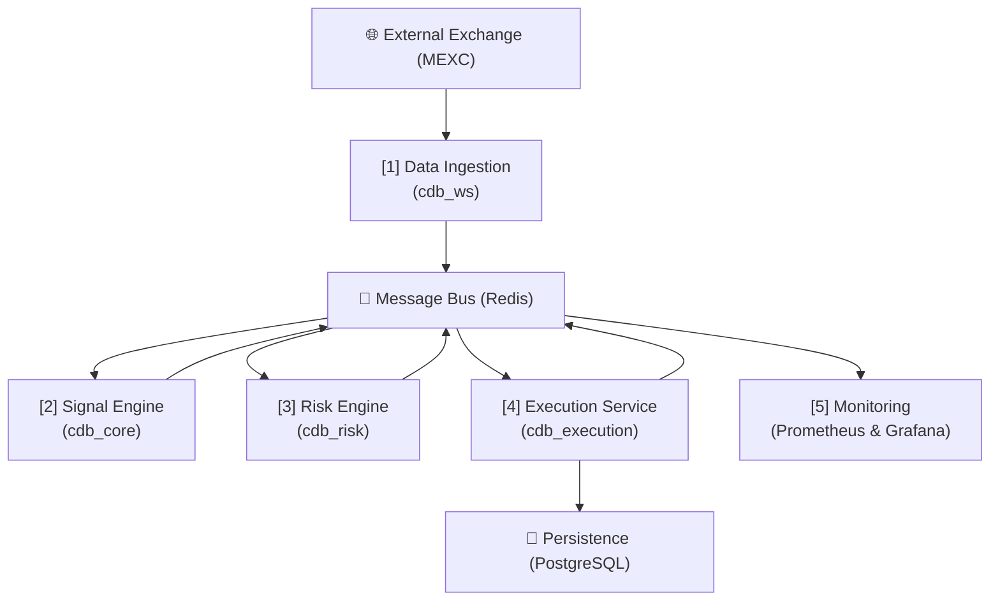

# CDB_FOUNDATION.md - The Technical Single Source of Truth

**Version**: 1.0
**Project**: Claire de Binare
**Author**: Claire-Architect & Intelligence Generator
**Purpose**: This document serves as the complete, consolidated, and canonical technical foundation for the Claire de Binare project. It is optimized for AI-driven analysis, strategic planning, and operational oversight.

---

## 1. Project Overview

### 1.1. Mission
Claire de Binare is a fully autonomous, event-driven momentum trading system for cryptocurrency perpetual futures. Its primary directive is to execute trading strategies with a strict, non-negotiable emphasis on capital preservation and risk management. The system is designed to be fully observable, auditable, and locally operable.

### 1.2. Core Principles (The KODEX)
- **Security over Profit**: Capital preservation is the highest priority. All operations are subordinate to risk controls.
- **Determinism over Blackbox**: Every action is the result of a documented, traceable rule or logic. Opaque ML models are forbidden in the critical execution path.
- **Local First**: The system must be fully runnable on local hardware using Docker, without hidden cloud dependencies or telemetry.
- **Clarity over Complexity**: Each component has a single, well-defined responsibility. Communication is explicit and follows a defined messaging schema.
- **Transparency over Magic**: Every event, decision, and trade is logged and persisted, ensuring full auditability.

### 1.3. Constraints
- **Phase N1 (Current)**: The system operates exclusively in a **Paper-Trading Mode**. No real capital is at risk.
- **Technology Stack**: The core stack is Python, Docker, PostgreSQL, and Redis. This is non-negotiable for the core services.
- **No Withdrawal Rights**: API keys used for live trading must *never* have withdrawal permissions.

---

## 2. Canonical System Architecture

Claire de Binare is an event-driven, microservices-based system. Services are decoupled and communicate asynchronously via a central message bus (Redis Pub/Sub). This design ensures modularity, scalability, and resilience.

### 2.1. High-Level Data Flow

The architecture follows a clear, linear pipeline for processing market data and executing trades:

1.  **Data Ingestion**: The `cdb_ws` service connects to the exchange's WebSocket feed and publishes raw market data events.
2.  **Signal Generation**: The `cdb_core` service consumes market data, applies technical analysis, and publishes trading signals.
3.  **Risk Management**: The `cdb_risk` service consumes signals, evaluates them against a multi-layered rule set (drawdown, exposure, etc.), and publishes approved orders.
4.  **Execution**: The `cdb_execution` service consumes approved orders, simulates their execution (in Phase N1), and publishes the results. It also persists all orders and trades to the database.
5.  **Monitoring**: The `cdb_prometheus` and `cdb_grafana` services provide observability into the health and performance of the entire system.

---

## 3. Services & Responsibilities

All services run as Docker containers orchestrated by `docker-compose`.

### 3.1. Active Services

| Service ID      | Container Name  | Responsibility                                           | Ports (Host:Cont) | Key Dependencies | Security Hardening |
|-----------------|-----------------|----------------------------------------------------------|-------------------|------------------|:------------------:|
| `cdb_redis`     | `cdb_redis`     | Central message bus and cache.                           | `6379:6379`       | -                | ❌                 |
| `cdb_postgres`  | `cdb_postgres`  | Long-term persistence for orders, trades, and events.    | `5432:5432`       | -                | ❌                 |
| `cdb_prometheus`| `cdb_prometheus`| Collects and stores time-series metrics from services.   | `19090:9090`      | -                | ❌                 |
| `cdb_grafana`   | `cdb_grafana`   | Visualizes metrics in dashboards.                        | `3000:3000`       | `cdb_prometheus` | ❌                 |
| `cdb_ws`        | `cdb_ws`        | Ingests real-time market data via WebSocket.             | `8000:8000`       | `cdb_redis`      | ✅                 |
| `cdb_core`      | `cdb_core`      | Generates trading signals from market data.              | `8001:8001`       | `cdb_redis`      | ✅                 |
| `cdb_risk`      | `cdb_risk`      | Applies risk rules to signals and approves orders.       | `8002:8002`       | `cdb_redis`      | ✅                 |
| `cdb_execution` | `cdb_execution` | Executes (simulates) orders and persists results.        | `8003:8003`       | `cdb_redis`, `cdb_postgres` | ✅ (non-root)      |
| `cdb_db_writer` | `cdb_db_writer` | Persists market data, signals, orders to PostgreSQL.     | None (internal)   | `cdb_redis`, `cdb_postgres` | ❌                 |
| `cdb_paper_runner` | `cdb_paper_runner` | Paper trading orchestrator and simulation engine.     | `8004:8004`       | `cdb_redis`, `cdb_postgres`, `cdb_core`, `cdb_risk`, `cdb_execution` | ✅ (non-root, read-only fs) |

### 3.2. Legacy Services (Removed from Active Deployment)

The following services have been formally deprecated and removed from the active system. See ADR-037 in the decision log for details.

| Service ID      | Container Name  | Status                                                   | Reason for Removal |
|-----------------|-----------------|----------------------------------------------------------|--------------------|
| `cdb_rest`      | `cdb_rest`      | Disabled (commented in docker-compose.yml)               | Missing entrypoint (`mexc_top_movers.py` not in repo), superseded by WebSocket ingestion |
| `cdb_signal_gen`| `cdb_signal_gen`| Orphaned (Dockerfile missing, build fails)               | Functionality replaced by `cdb_core` signal engine |

---

## 4. Event Flow & Messaging Model

Communication is exclusively handled by Redis Pub/Sub to ensure service decoupling.

| Topic           | Producer(s)       | Consumer(s)               | Schema                                              | Purpose                                      |
|-----------------|-------------------|---------------------------|-----------------------------------------------------|----------------------------------------------|
| `market_data`   | `cdb_ws`          | `cdb_core`                | `{symbol, price, volume, timestamp}`                | Distributes real-time market data.           |
| `signals`       | `cdb_core`        | `cdb_risk`                | `{symbol, direction, strength}`                     | Proposes a trade based on strategy logic.    |
| `orders`        | `cdb_risk`        | `cdb_execution`           | `{order_id, symbol, side, quantity, price}`         | Submits a risk-approved order for execution. |
| `order_results` | `cdb_execution`   | (Monitoring/Future PSM)   | `{order_id, status, filled_price, fees}`            | Broadcasts the outcome of an executed order. |
| `alerts`        | `cdb_risk`, `cdb_execution` | (Monitoring/UI) | `{level, code, message}`                            | Reports significant system or risk events.   |

---

## 5. Database Schema

Persistence is handled by PostgreSQL. The schema is initialized from `DATABASE_SCHEMA.sql`.

- **`orders` table**: The canonical log of every order requested by the risk engine.
  - `order_id` (PK), `symbol`, `side`, `quantity`, `price`, `status` (`PENDING`, `FILLED`, `FAILED`), `submitted_at`, `filled_at`.
- **`trades` table**: The log of filled orders, forming the basis of performance analysis.
  - `trade_id` (PK), `order_id` (FK), `entry_price`, `exit_price`, `profit_loss`.

---

## 6. Environment & Configuration (`.env`)

Configuration is managed via a `.env` file in the project root, based on `.env.example`.

### Key Variables:
- **Infrastructure**: `POSTGRES_HOST`, `POSTGRES_USER`, `POSTGRES_PASSWORD`, `POSTGRES_DB`, `REDIS_HOST`, `REDIS_PASSWORD`.
- **Trading Mode**: `TRADING_MODE` (`paper` or `live`), `ACCOUNT_EQUITY`.
- **Risk Engine Limits**:
  - `MAX_POSITION_PCT`: Max % of equity for a single position.
  - `MAX_DAILY_DRAWDOWN_PCT`: "Circuit breaker" for daily loss.
  - `MAX_TOTAL_EXPOSURE_PCT`: Max % of equity allocated across all positions.
  - `DATA_STALE_TIMEOUT_SEC`: Timeout for stale market data.

---

## 7. Operating Environment

The system is designed for a Windows 10/11 host running **Docker Desktop with the WSL2 backend**.
- **Source Code**: Lives on the Windows filesystem (e.g., `C:\Users\...\Claire_de_Binare`).
- **Docker Engine**: Runs within a managed WSL2 virtual machine.
- **File Access**: Docker volumes mount the source code from the Windows filesystem into the containers running in WSL2. This is performant due to the native integration provided by Docker Desktop.
- **Execution**: All `docker` and `docker-compose` commands are run from a shell on the Windows host (e.g., PowerShell, CMD).

---

## 8. Phase N1 (Paper-Trading)

The current operational phase is N1, which has the following characteristics:
- **No Live Broker**: The `cdb_execution` service does *not* connect to a live exchange. It simulates fills based on a simple logic (e.g., fill at the next `market_data` event price).
- **Simulated Equity**: The starting capital is defined by `ACCOUNT_EQUITY` in the `.env` file. All P&L calculations are based on this simulated value.
- **Zero-Activity Incident**: If the system receives no new market data for a period defined by `DATA_STALE_TIMEOUT_SEC`, the risk engine will pause all new orders and issue a `DATA_STALE` alert.

---

## 9. Operational KPIs & Thresholds

These are the primary risk parameters that govern the system's behavior. They are configured in `.env`.

| Parameter                  | ENV Variable                | Default | Layer | Effect of Breach                                    |
|----------------------------|-----------------------------|---------|-------|-----------------------------------------------------|
| Daily Drawdown Limit       | `MAX_DAILY_DRAWDOWN_PCT`    | `0.05`  | 1     | **Hard Stop**. Halt all trading, requires manual reset. |
| Stale Data Timeout         | `DATA_STALE_TIMEOUT_SEC`    | `60`    | 3     | **Circuit Breaker**. Pause new orders.              |
| Total Exposure Limit       | `MAX_TOTAL_EXPOSURE_PCT`    | `0.30`  | 4     | **Soft Stop**. Block new orders.                    |
| Position Size Limit        | `MAX_POSITION_PCT`          | `0.10`  | 5     | Trim order size to fit limit.                       |
| Max Slippage               | `MAX_SLIPPAGE_PCT`          | `0.02`  | Execution | Order rejection, alert to risk manager.       |

**Note on Backwards Compatibility:** The system supports `MAX_EXPOSURE_PCT` as a deprecated alias for `MAX_TOTAL_EXPOSURE_PCT`. If both are set, `MAX_TOTAL_EXPOSURE_PCT` takes precedence. New deployments should use `MAX_TOTAL_EXPOSURE_PCT` exclusively.

---

## 10. Glossary

- **Signal**: A potential trading opportunity generated by the `cdb_core`. It is a *proposal*, not an order.
- **Order**: A risk-approved instruction to trade, generated by `cdb_risk`.
- **Trade**: The result of a filled order.
- **Exposure**: The total value of all open positions.
- **Drawdown**: The percentage loss from a portfolio's peak value.
- **Circuit Breaker**: An automatic mechanism that temporarily pauses trading in response to anomalous conditions (e.g., stale data, high volatility).
- **Incident**: A significant event that may require manual intervention, reported via the `alerts` topic.

---

## 11. Testing Model

The project maintains a multi-layered testing strategy.

- **Unit Tests**: Test individual functions in isolation. (`pytest -m "not e2e and not local_only"`)
- **Integration Tests**: Test the interaction between a service and its direct dependencies (e.g., a service and the database).
- **End-to-End (E2E) Tests**: Test the full data pipeline from `cdb_ws` to `cdb_execution`. Requires the full Docker stack. (`pytest -m e2e`)
- **Local Tests**: Custom tests for performance, stress, and Docker lifecycle. (`pytest -m local_only`)

---

## 12. CI/CD & Automation

- **CircleCI** (`.circleci/config.yml`): Configured for continuous integration, primarily running unit tests on each commit.
- **GitHub Actions** (`.github/workflows/ci.yaml`): Provides a parallel CI setup.
- **Makefile**: Provides helper commands for common tasks like `make test-local`.

---

## 13. Monitoring Architecture

- **Prometheus**: Scrapes `/metrics` endpoints from `cdb_core`, `cdb_risk`, and `cdb_execution` at a 15s interval.
- **Grafana**: Provides visualization dashboards. It is pre-configured with Prometheus as a data source. Dashboards are provisioned from the `backoffice/grafana/dashboards` directory.
- **Health Checks**: All core services expose a `/health` endpoint, which is monitored by Docker Compose to manage container health.

---

## 14. Conventions

- **Repository Structure**: All canonical documentation is located in `backoffice/docs`. All application source code is in `services`.
- **File Naming**:
    - Major Docs: `UPPERCASE_WITH_UNDERSCORES.md`
    - Python/YAML: `snake_case.py`/`.yaml`
- **Commits**: Follow the Conventional Commits specification (e.g., `feat(risk): add new limit`).

---

## 15. Security & ENV Discipline

- **Secrets Management**: All secrets (passwords, API keys) **must** be stored exclusively in the `.env` file. This file is listed in `.gitignore` and must never be committed to the repository.
- **Service Hardening**: Core application services (`cdb_ws`, `cdb_core`, `cdb_risk`, `cdb_execution`) are hardened in Docker with the following security options:
  - `no-new-privileges:true`: Prevents processes from gaining more privileges.
  - `cap_drop: ALL`: Drops all Linux capabilities.
  - `read_only: true`: Mounts the container's filesystem as read-only.
  - `tmpfs: /tmp`: Provides a temporary, in-memory filesystem for runtime needs.
- **Inconsistency Note**: The infrastructure services (`redis`, `postgres`, etc.) and the legacy `cdb_rest` service do not have these hardening features applied.

---

## 16. Inferred Missing Elements & Gaps

The following elements are absent from the current architecture but are critical for future stability and growth:

1.  **Centralized Configuration Management**: The reliance on a single `.env` file is brittle. A dedicated configuration service or a more robust loading mechanism (e.g., using Pydantic's settings management) is needed.
2.  **Secret Management Solution**: For any production-like environment, secrets must be moved out of the `.env` file and into a secure vault (e.g., HashiCorp Vault, AWS/GCP Secret Manager).
3.  **Portfolio & State Manager (PSM)**: A dedicated service to manage the consolidated state of the portfolio (positions, equity, exposure) is missing. Currently, this logic is likely fragmented between the `risk` and `execution` services. A PSM would centralize this, providing a single source of truth for portfolio state.
4.  **Dedicated Backtesting Service**: The current setup implies running the system with historical data, but there is no dedicated service to manage, run, and compare backtest results.
5.  **Data Retention & Archival Policy**: There are no defined policies for how long data in PostgreSQL should be kept or how it should be archived.
6.  **Metric Coverage**: Prometheus scraping is configured, but `cdb_ws` and `cdb_rest` are not scraped. A comprehensive metrics strategy is needed for all services.
7.  **Service Resolution**: The `cdb_rest` and `cdb_signal_gen` services are in a broken or orphaned state and should be formally removed or properly integrated.

---

## 17. Minimaler Artefakt-Set für Neues Repository

This section defines the minimal set of artifacts required to create a new, clean, and fully runnable instance of the Claire de Binare project. The goal is to migrate only what is essential for the system's core functionality.

### Kategorie: Docker & Infrastruktur

| Pflicht? | Pfad                                           | Begründung                                                                              |
|:---------|:-----------------------------------------------|:----------------------------------------------------------------------------------------|
| Ja       | `docker-compose.yml`                           | Definiert alle Services, Netzwerke, Volumes und deren Zusammenspiel. Das Herz der Infra.  |
| Ja       | `Dockerfile`                                   | Haupt-Dockerfile, das von `cdb_ws` verwendet wird.                                      |
| Ja       | `prometheus.yml`                               | Konfiguriert Prometheus zum Scrapen der Service-Metriken.                               |
| Ja       | `backoffice/docs/DATABASE_SCHEMA.sql`          | Initialisiert das PostgreSQL-Datenbankschema beim ersten Start.                         |
| Ja       | `backoffice/grafana/`                          | Provisioniert Grafana mit Datenquellen und Dashboards. Essentiell für Monitoring.       |
| Ja       | `backoffice/migrations/`                       | Stellt sicher, dass Datenbankschema-Änderungen nachvollziehbar sind.                    |
| Ja       | `backoffice/services/signal_engine/Dockerfile` | Spezifisches Dockerfile für den `cdb_core` Service.                                     |
| Ja       | `backoffice/services/risk_manager/Dockerfile`  | Spezifisches Dockerfile für den `cdb_risk` Service.                                     |
| Ja       | `backoffice/services/execution_service/Dockerfile` | Spezifisches Dockerfile für den `cdb_execution` Service.                            |
| Ja       | `backoffice/services/db_writer/Dockerfile`     | Spezifisches Dockerfile für den `cdb_db_writer` Service.                                |
| Ja       | `services/cdb_paper_runner/Dockerfile`         | Spezifisches Dockerfile für den `cdb_paper_runner` Service.                             |

### Kategorie: Konfiguration & Code-Qualität

| Pflicht? | Pfad                         | Begründung                                                                               |
|:---------|:-----------------------------|:-----------------------------------------------------------------------------------------|
| Ja       | `.env.example`               | Vorlage für alle zur Laufzeit benötigten Umgebungsvariablen und Secrets.               |
| Ja       | `requirements.txt`           | Python-Abhängigkeiten für die Hauptanwendung.                                            |
| Ja       | `requirements-dev.txt`       | Zusätzliche Abhängigkeiten für Entwicklung und Tests.                                    |
| Ja       | `pytest.ini`                 | Konfiguriert das Test-Framework `pytest`.                                                |
| Ja       | `.gitignore`                 | Stellt sicher, dass keine ungewollten Dateien (z.B. `.env`, logs, caches) committet werden. |
| Ja       | `.dockerignore`              | Verhindert, dass unnötige Dateien in die Docker-Images kopiert werden.                   |
| Optional | `.editorconfig`, `.pre-commit-config.yaml`, `.markdownlintrc` | Fördert einheitliche Code-Qualität und -Formatierung, nicht zwingend für die Funktion. |

### Kategorie: Applikationscode & Services

| Pflicht? | Pfad                                  | Begründung                                                                                    |
|:---------|:--------------------------------------|:----------------------------------------------------------------------------------------------|
| Ja       | `tests/mexc_top5_ws.py`               | Wird vom `cdb_ws` Service als Hauptskript ausgeführt (gem. `docker-compose.yml`).           |
| Ja       | `backoffice/services/signal_engine/`  | Source Code für den `cdb_core` Service.                                                     |
| Ja       | `backoffice/services/risk_manager/`   | Source Code für den `cdb_risk` Service.                                                     |
| Ja       | `backoffice/services/execution_service/` | Source Code für den `cdb_execution` Service.                                              |
| Ja       | `backoffice/services/db_writer/`      | Source Code für den `cdb_db_writer` Service.                                                |
| Ja       | `services/cdb_paper_runner/`          | Source Code für den `cdb_paper_runner` Service.                                             |

### Kategorie: Tests & CI/CD

| Pflicht? | Pfad                          | Begründung                                                                                             |
|:---------|:------------------------------|:-------------------------------------------------------------------------------------------------------|
| Ja       | `tests/`                      | Enthält alle Unit-, Integrations- und E2E-Tests, die zur Verifizierung des Systems nötig sind.       |
| Ja       | `.github/workflows/ci.yaml`   | Definiert die primäre CI-Pipeline, die bei Commits und PRs ausgeführt wird.                            |
| Ja       | `Makefile`                    | Stellt standardisierte Befehle zum Testen, Bauen und Verwalten des Stacks bereit (`make test` etc.). |
| Ja       | `run-tests.ps1`               | Hauptskript zur Ausführung der Test-Suite.                                                             |
| Ja       | `backoffice/scripts/systemcheck.py` | Wichtiges Skript zur Überprüfung der System- und Umgebungskonfiguration.                         |
| Optional | `.github/` (restliche Dateien) | Enthält Vorlagen für PRs, CODEOWNERS etc. Wichtig für Projekt-Governance, aber nicht für die Funktion. |

### Kategorie: Dokumentation

| Pflicht? | Pfad                   | Begründung                                                                                                      |
|:---------|:-----------------------|:----------------------------------------------------------------------------------------------------------------|
| Ja       | `backoffice/docs/`     | Enthält die kanonische Systemdokumentation (`FOUNDATION`, `GOVERNANCE` etc.), die die Single Source of Truth ist. |
| Optional | `README.md`            | Dient als primärer Einstiegspunkt in das Repository.                                                            |

### Nicht zu migrierende Artefakte (Legacy)

- **`_archive/`**: Per Definition veraltet.
- **`logs/`**: Laufzeit-Artefakte, werden im neuen Repo neu generiert.
- **`CDB_MASTER_PLAN.md`**: Ersetzt durch die detaillierteren Dokumente in `backoffice/docs/`.
- **`services/*.py` (im Root-Verzeichnis)**: Diese Skripte (`execution_simulator.py`, `risk_engine.py` etc.) scheinen veraltete Versionen der Services zu sein, die jetzt in `backoffice/services/` liegen und über `docker-compose` gestartet werden.
- **Cache- & Tool-Verzeichnisse**: `.claude/`, `.gemini/`, `.mypy_cache/`, `.pytest_cache/`, `.venv/`.

## 18. Extended Artifact Set (Tier 2 – Tools & Scripts)

This section catalogs artifacts that are not strictly essential for a minimal system startup (Tier 1) but provide significant value for operations, development, maintenance, and analysis. They are recommended for migration to ensure a fully-featured and maintainable development environment.

### Ops & Maintenance

Scripts for system checks, maintenance, diagnostics, and data management.

| Priorität | Typ | Pfad | Begründung |
|:---|:---|:---|:---|
| Empfohlen | Script | `backoffice/scripts/backup_postgres.ps1` | Kritisches Skript zur Erstellung von Datenbank-Backups. |
| Empfohlen | Script | `backoffice/scripts/setup_backup_task.ps1` | Richtet die automatisierte Ausführung der Backup-Skripte ein. |
| Empfohlen | Script | `backoffice/scripts/daily_check.py` | Führt tägliche System-Checks zur Überwachung der Stabilität durch. |
| Empfohlen | Script | `scripts/migration/` | Enthält essenzielle Skripte für die Daten- und Systemmigration. |
| Empfohlen | Script | `backoffice/automation/check_env.ps1` | Überprüft die Umgebungsvariablen auf Vollständigkeit und Korrektheit. |

### Dev & Code-Tools

Helper scripts and tools that support the development lifecycle, code quality, and testing.

| Priorität | Typ | Pfad | Begründung |
|:---|:---|:---|:---|
| Empfohlen | Script | `tests/run_tests.ps1` | Alternatives Test-Runner-Skript, das sich direkt im Testverzeichnis befindet. |
| Empfohlen | Script | `scripts/security_audit.sh` | Führt einen grundlegenden Sicherheitsaudit des Repositorys durch. |
| Empfohlen | Script | `tests/publish_test_events.py` | Hilfsskript zum Einspeisen von Test-Events in das System für Debugging. |
| Empfohlen | Script | `tests/validate_persistence.py` | Validiert die korrekte Persistenz von Daten nach Testläufen. |
| Empfohlen | Script | `tests/validate_setup.ps1` | Überprüft die korrekte Einrichtung und Konfiguration der Testumgebung. |
| Optional | Script | `scripts/link_check.py` | Überprüft Markdown-Dateien auf defekte Links zur Sicherung der Doku-Qualität. |
| Optional | Script | `scripts/provenance_hash.py` | Erzeugt Hashes zur Nachverfolgung der Herkunft von Artefakten. |

### Research & Backtesting

Artifacts used for strategy evaluation, data analysis, and simulated trading.

| Priorität | Typ | Pfad | Begründung |
|:---|:---|:---|:---|
| Empfohlen | Service | `services/execution_simulator.py` | Veralteter Service, dessen Logik für Backtesting-Zwecke relevant ist. |
| Empfohlen | Script | `backoffice/scripts/query_analytics.py` | Skript zur Abfrage und Analyse von historischen Handels- und Performancedaten. |
| Empfohlen | Script | `tests/test_execution_simulator.py` | Wichtiger Test zur Validierung der Logik des Execution Simulators. |

### Auxiliary Services

Non-essential services that enhance the system's capabilities.

| Priorität | Typ | Pfad | Begründung |
|:---|:---|:---|:---|
| Optional | Service | `backoffice/services/db_writer/db_writer.py` | Beispiel eines separaten Service zum Schreiben von Daten in die Datenbank, kann als Muster dienen. |

### Templates & Meta

Templates and meta-files that enforce consistency and document project standards.

| Priorität | Typ | Pfad | Begründung |
|:---|:---|:---|:---|
| Empfohlen | Template | `.github/PULL_REQUEST_TEMPLATE.md` | Stellt Konsistenz und Vollständigkeit bei der Erstellung von Pull Requests sicher. |
| Empfohlen | Template | `.github/ISSUE_TEMPLATE/` | Vorlagen für das standardisierte Melden von Bugs und Feature-Requests. |
| Optional | Config | `backoffice/grafana/dashboards/` | Vordefinierte Grafana-Dashboards zur Visualisierung von Systemmetriken. |
| Optional | Template | `.claude/blueprints/` | Claude-spezifische Vorlagen, die für die Entwicklung von KI-Agenten nützlich sein können. |
| Optional | Template | `backoffice/docs/adr/` | Verzeichnis für Architektur-Entscheidungs-Records zur Dokumentation von Design-Entscheidungen. |