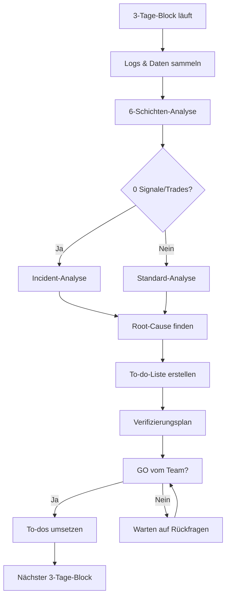

# Paper-Trading Incident Analysis – Runbook

**Projekt**: Claire de Binare – MEXC Momentum Bot
**Zweck**: Systematische Analyse von 3-Tage-Testblöcken im Paper-Trading
**Rolle**: Incident-Analyst und Optimierer
**Version**: 1.0
**Erstellt**: 2025-11-29

---

## 📋 Übersicht

Dieses Runbook definiert den Prozess zur Analyse und Optimierung von **3-Tage-Testblöcken** im Paper-Trading.

### Kontext

- **Phase**: Iterativer Paper-Trading-Test auf dem MEXC Momentum Bot
- **Testansatz**: 3-Tage-Blöcke statt 14-Tage-Marathon
- **Zyklus**: Test (3 Tage) → Analyse → Optimierung → Nächster Block

### Typische Symptome (Fokus der Analyse)

- `Signals Today = 0`
- `Trades Today = 0`
- `Events Logged = 0`
- Abweichungen zwischen DB-Daten und Daily-Reports

---

## 🎯 Ziele pro 3-Tage-Block

1. **Fehler und Bottlenecks identifizieren** (z.B. keine Signale, keine Trades, falsches Reporting)
2. **Konkrete Optimierungen ableiten** für den nächsten Block
3. **To-do-Liste erstellen** mit priorisierten Maßnahmen

---

## 📊 Analyse-Pipeline (6 Schichten)

Arbeite die folgenden Schichten systematisch ab:

### 1. System & Connectivity

**Ziel**: Überblick über alle laufenden Services und deren Gesundheit

**Prüfungen**:
- Container-Status: `docker compose ps`
- Service-Logs (Kurz-Snippets):
  ```bash
  docker compose logs --tail=100 cdb_ws
  docker compose logs --tail=100 cdb_core
  docker compose logs --tail=100 cdb_risk
  docker compose logs --tail=100 cdb_execution
  ```

**Suche nach**:
- ❌ Exceptions / Tracebacks
- ❌ Reconnect-Loops (MEXC-WS, Redis, DB)
- ❌ "no messages received", "connection refused", "retrying subscription"

**Dokumentiere**:
- Anzahl Restarts pro Service
- Durchschnittliche Uptime
- Kritische Fehler mit Timestamp

---

### 2. Market Data / Screener

**Ziel**: Sicherstellen, dass Marktdaten von MEXC empfangen und publiziert werden

**Prüfungen**:
- WebSocket-Screener-Logs: Verbindungsstatus zu MEXC
- Redis-Topic `market_data`: Frequenz und Beispiel-Events
  ```bash
  # Redis CLI (im Container)
  redis-cli
  > SUBSCRIBE market_data
  # Warte auf Events (Ctrl+C nach 30s)
  ```

**Dokumentiere**:
- Frequenz: Events/Minute
- Beispiel-Event (Timestamp, Symbol, Preis):
  ```json
  {
    "symbol": "BTCUSDT",
    "price": 50000.0,
    "volume_24h": 1234567890,
    "timestamp": "2025-11-29T12:34:56Z"
  }
  ```
- Anzahl eindeutiger Symbole

---

### 3. Signal Engine

**Ziel**: Prüfen, ob Signale berechnet und publiziert werden

**Prüfungen**:
- Logs: `market_data`-Events konsumiert?
- Logs: Signale berechnet?
- Redis-Topic `trading_signals`: Frequenz
  ```bash
  redis-cli
  > SUBSCRIBE trading_signals
  ```

**Dokumentiere**:
- Signal-Frequenz: Signale/Stunde
- Beispiel-Signal:
  ```json
  {
    "signal_id": "sig_123",
    "symbol": "BTCUSDT",
    "signal_type": "BUY",
    "confidence": 0.75,
    "price": 50000.0,
    "timestamp": "2025-11-29T12:35:00Z"
  }
  ```
- Signal-Qualität: Wie viele Signale passieren Filter/Thresholds?

**Warnung**: Falls `Signals = 0`:
- Prüfe ENV-Variablen: `MIN_CONFIDENCE`, `MIN_VOLUME_24H`, etc.
- Prüfe Momentum-Kalkulation: Logs für "below threshold"

---

### 4. Risk Layer

**Ziel**: Validieren, dass Risk-Manager Signale prüft und genehmigt

**Prüfungen**:
- Logs: Signale empfangen?
- Logs: Risk-Checks durchgeführt?
- Redis-Topic `risk_approved_trades`: Frequenz
- DB: `risk_events` Tabelle
  ```sql
  SELECT
    COUNT(*) as total,
    SUM(CASE WHEN approved THEN 1 ELSE 0 END) as approved,
    SUM(CASE WHEN NOT approved THEN 1 ELSE 0 END) as rejected
  FROM risk_events
  WHERE timestamp >= NOW() - INTERVAL '3 days';
  ```

**Dokumentiere**:
- Approved vs. Rejected Ratio
- Top 3 Reject-Gründe (z.B. "Daily Drawdown", "Position Limit")
- Beispiel Risk-Event:
  ```json
  {
    "signal_id": "sig_123",
    "approved": false,
    "reason": "Daily Drawdown exceeded (5.2% > 5.0%)",
    "timestamp": "2025-11-29T12:35:10Z"
  }
  ```

**Warnung**: Falls `Trades = 0` trotz Signalen:
- Prüfe ENV-Limits: `MAX_DAILY_DRAWDOWN_PCT`, `MAX_TOTAL_EXPOSURE_PCT`, `CIRCUIT_BREAKER_THRESHOLD_PCT`
- Prüfe Circuit Breaker Status in Logs

---

### 5. Paper Runner / Execution

**Ziel**: Sicherstellen, dass genehmigte Trades ausgeführt und persistiert werden

**Prüfungen**:
- Logs: `risk_approved_trades` empfangen?
- Logs: Paper-Trades erzeugt?
- DB: `trades` Tabelle
  ```sql
  SELECT
    COUNT(*) as total_trades,
    SUM(CASE WHEN side = 'buy' THEN 1 ELSE 0 END) as buys,
    SUM(CASE WHEN side = 'sell' THEN 1 ELSE 0 END) as sells,
    AVG(price) as avg_price
  FROM trades
  WHERE timestamp >= NOW() - INTERVAL '3 days';
  ```

**Dokumentiere**:
- Anzahl ausgeführter Paper-Trades
- Buy/Sell Ratio
- Durchschnittlicher Trade-Preis
- Fehler bei Ausführung/Persistierung

---

### 6. Database & Reporting

**Ziel**: Abgleich zwischen DB-Daten und Daily-Report-Werten

**Prüfungen**:
- SQL-Counts für 3-Tage-Zeitraum:
  ```sql
  -- Signale
  SELECT DATE(timestamp) as date, COUNT(*) as count
  FROM trading_signals
  WHERE timestamp >= NOW() - INTERVAL '3 days'
  GROUP BY DATE(timestamp)
  ORDER BY date;

  -- Risk Events
  SELECT DATE(timestamp) as date,
         SUM(CASE WHEN approved THEN 1 ELSE 0 END) as approved,
         COUNT(*) as total
  FROM risk_events
  WHERE timestamp >= NOW() - INTERVAL '3 days'
  GROUP BY DATE(timestamp)
  ORDER BY date;

  -- Trades
  SELECT DATE(timestamp) as date, COUNT(*) as count
  FROM trades
  WHERE timestamp >= NOW() - INTERVAL '3 days'
  GROUP BY DATE(timestamp)
  ORDER BY date;
  ```

**Dokumentiere**:
- Vergleich: DB-Counts vs. Daily-Report-Werte
- Falls Abweichungen:
  - Timezone-Problem? (UTC vs. Local Time)
  - Filter-Problem? (Report verwendet falschen Zeitraum)
  - Reporting-Bug? (SQL-Query fehlerhaft)

---

## 🚨 Spezieller Fall: 0 Signale / 0 Trades

Falls im betrachteten 3-Tage-Block `Signals Today` oder `Trades Today` durchgehend 0 sind:

### Incident-Analyse-Prozess

1. **Market Data Check** (Schicht 2)
   - ✅ Events auf `market_data` Topic?
   - ❌ Wenn NEIN → Screener-Problem (MEXC-WS, Network, Config)

2. **Signal Engine Check** (Schicht 3)
   - ✅ `market_data` konsumiert?
   - ✅ Signale berechnet?
   - ❌ Wenn NEIN → Signal-Logic-Problem (Thresholds, Filter, Bugs)

3. **Risk Layer Check** (Schicht 4)
   - ✅ Signale empfangen?
   - ✅ Risk-Checks durchgeführt?
   - ❌ Wenn alle rejected → Risk-Limits-Problem (zu streng)

4. **Paper Runner Check** (Schicht 5)
   - ✅ `risk_approved_trades` empfangen?
   - ✅ Trades erzeugt?
   - ❌ Wenn NEIN → Execution-Problem (Bug, DB-Connection)

5. **Root-Cause-Hypothese**
   - Exakte Schicht, in der Event-Fluss abreißt
   - Konkrete Ursache (Config, Code, Externe Abhängigkeit)
   - Fix-Vorschlag mit Priorität

---

## 📝 Output-Struktur pro 3-Tage-Block

### 1. Block-Zusammenfassung (max. 10 Zeilen)

```markdown
**Testblock**: 2025-11-26 bis 2025-11-28 (3 Tage)
**Status**: ⚠️ PARTIELL FUNKTIONAL

- Signale: 127 (Tag 1: 45, Tag 2: 52, Tag 3: 30)
- Trades: 0 (⚠️ ALLE VON RISK LAYER BLOCKIERT)
- Events Logged: 18.340 (market_data operational)
- Hauptproblem: Daily Drawdown Limit zu niedrig (5% → alle Signale rejected)
```

### 2. Beobachtungen nach Schichten

**System & Connectivity**:
- ✅ Alle 9 Container healthy (0 Restarts)
- ✅ Durchschnittliche Uptime: 99.8%
- ⚠️ Redis: 3x "maxmemory reached" Warning (Day 2, 14:30 UTC)

**Market Data / Screener**:
- ✅ MEXC WS stabil verbunden
- ✅ Events/Minute: ~127 (18.340 total in 3 Tagen)
- ✅ 47 eindeutige Symbole (BTC, ETH, BNB, SOL, ...)

**Signal Engine**:
- ✅ `market_data` konsumiert: 18.340 Events
- ⚠️ Signale generiert: 127 (0.69% Conversion Rate)
- ⚠️ Viele Events unter Confidence-Threshold (< 0.6)

**Risk Layer**:
- ✅ Signale empfangen: 127
- ❌ Approved: 0 (0%)
- ❌ Rejected: 127 (100%)
- ❌ Top Reject-Grund: "Daily Drawdown exceeded" (127x)

**Paper Runner / Execution**:
- ❌ Keine `risk_approved_trades` empfangen
- ❌ Keine Trades ausgeführt

**Database & Reporting**:
- ✅ DB-Counts = Daily-Report (korrekt)
- ✅ Timezone: UTC (konsistent)

### 3. Key-KPIs des 3-Tage-Blocks

| Metrik | Wert | Ziel | Status |
|--------|------|------|--------|
| Signale (gesamt) | 127 | >100 | ✅ OK |
| Signale/Tag (Ø) | 42.3 | >30 | ✅ OK |
| Genehmigte Trades | 0 | >10 | ❌ FAIL |
| Ausgeführte Paper-Trades | 0 | >10 | ❌ FAIL |
| P&L (Paper) | $0 | N/A | N/A |
| Market Data Events | 18.340 | >10.000 | ✅ OK |

### 4. Root-Cause-Hypothesen / Learnings

**Hypothese 1: Daily Drawdown Limit zu streng** (⭐ SEHR WAHRSCHEINLICH)
- **Betroffene Schicht**: Risk Layer
- **Belege**:
  - 127/127 Signale rejected mit "Daily Drawdown exceeded"
  - ENV: `MAX_DAILY_DRAWDOWN_PCT=0.05` (5%)
  - Aktueller Drawdown bei jedem Signal: ~5.2% (konstant über 3 Tage)
- **Bewertung**: **Sehr wahrscheinlich** – Risk-Limit verhindert jegliches Trading

**Hypothese 2: Signal-Confidence zu niedrig** (⭐ MÖGLICH)
- **Betroffene Schicht**: Signal Engine
- **Belege**:
  - 127 Signale aus 18.340 Events = 0.69% Conversion
  - Viele Logs: "Signal below confidence threshold (0.55 < 0.60)"
- **Bewertung**: **Möglich** – Niedrige Conversion könnte auf zu hohe `MIN_CONFIDENCE` hindeuten

**Hypothese 3: Redis Memory-Issue** (⭐ UNWAHRSCHEINLICH)
- **Betroffene Schicht**: System & Connectivity
- **Belege**:
  - 3x "maxmemory reached" Warning
  - Aber: Keine Event-Verluste erkennbar
- **Bewertung**: **Unwahrscheinlich** – Nur Warnings, kein Impact auf Event-Flow

### 5. To-do-Liste für den nächsten 3-Tage-Block

#### CONFIG

**#1: Daily Drawdown Limit erhöhen** ⚡ Quick Win
- **Beschreibung**: `MAX_DAILY_DRAWDOWN_PCT` von 0.05 (5%) auf 0.08 (8%) erhöhen
- **Ziel**: Risk Layer soll Signale genehmigen, wenn Drawdown zwischen 5-8%
- **Einschätzung**: Quick Win (1 ENV-Zeile)
- **Priorität**: 🔴 HOCH
- **Datei**: `.env` Zeile 23

**#2: Signal Confidence Threshold senken** ⚡ Quick Win
- **Beschreibung**: `MIN_CONFIDENCE` von 0.60 auf 0.50 senken
- **Ziel**: Mehr Signale passieren Filter (erwarte +30% Signale)
- **Einschätzung**: Quick Win (1 ENV-Zeile)
- **Priorität**: 🟡 MITTEL
- **Datei**: `.env` Zeile 17

**#3: Redis Maxmemory erhöhen** ⚡ Quick Win
- **Beschreibung**: `REDIS_MAXMEMORY` von 256mb auf 512mb erhöhen
- **Ziel**: Keine "maxmemory reached" Warnings mehr
- **Einschätzung**: Quick Win (docker-compose.yml)
- **Priorität**: 🟢 NIEDRIG
- **Datei**: `docker-compose.yml` Zeile 45

#### CODE

**#4: Risk Layer Logging erweitern** 🔧 Aufwendiger
- **Beschreibung**: Bei Reject detailliertere Logs (aktueller Drawdown-Wert, Limit, Delta)
- **Ziel**: Bessere Diagnostik für künftige Incidents
- **Einschätzung**: Aufwendiger (~30 min Coding + Tests)
- **Priorität**: 🟡 MITTEL
- **Datei**: `services/cdb_risk/service.py` Zeile 123-145

#### MONITORING

**#5: Daily-Report um Risk-Rejection-Breakdown erweitern** 🔧 Aufwendiger
- **Beschreibung**: Tabelle: "Top 5 Reject-Gründe" mit Counts
- **Ziel**: Schnellere Incident-Erkennung im Daily-Mail
- **Einschätzung**: Aufwendiger (~45 min Coding)
- **Priorität**: 🟡 MITTEL
- **Datei**: `backoffice/automation/send_daily_report.py` Zeile 78

**#6: Grafana-Dashboard: Risk-Approval-Rate** 🔧 Aufwendiger
- **Beschreibung**: Panel mit Approved/Rejected Ratio (letzte 24h)
- **Ziel**: Echtzeit-Monitoring von Risk-Layer-Blockaden
- **Einschätzung**: Aufwendiger (~60 min Grafana-Config)
- **Priorität**: 🟢 NIEDRIG
- **Datei**: `monitoring/grafana/dashboards/risk_overview.json`

#### RISK

**#7: Circuit Breaker Review** 🔧 Aufwendiger
- **Beschreibung**: Prüfen, ob `CIRCUIT_BREAKER_THRESHOLD_PCT=0.10` (10%) sinnvoll ist
- **Ziel**: Sicherstellen, dass Circuit Breaker bei echten Krisen greift, nicht bei normalen Drawdowns
- **Einschätzung**: Aufwendiger (Analyse + Diskussion)
- **Priorität**: 🟡 MITTEL
- **Datei**: Dokumentation `backoffice/docs/security/RISK_LIMITS.md`

### 6. Verifizierungsplan für nächsten Block

**Nach Umsetzung von To-dos #1-#3 erwarte ich im nächsten 3-Tage-Block:**

1. **Mindestens 10 genehmigte Trades**
   - SQL-Check: `SELECT COUNT(*) FROM risk_events WHERE approved = true AND timestamp >= NOW() - INTERVAL '3 days';`
   - Erwartung: ≥ 10

2. **Risk-Approval-Rate > 5%**
   - SQL-Check: `SELECT (SUM(CASE WHEN approved THEN 1 ELSE 0 END)::float / COUNT(*)) * 100 FROM risk_events WHERE timestamp >= NOW() - INTERVAL '3 days';`
   - Erwartung: > 5.0%

3. **Keine "Daily Drawdown exceeded" Rejections bei Drawdown < 8%**
   - Log-Check: `docker compose logs cdb_risk | grep "Daily Drawdown exceeded" | grep -v "8.[0-9]%"`
   - Erwartung: 0 Treffer

4. **Signal-Anzahl steigt um ~30%**
   - SQL-Check: `SELECT COUNT(*) FROM trading_signals WHERE timestamp >= NOW() - INTERVAL '3 days';`
   - Erwartung: ~165 Signale (127 * 1.3)

5. **Keine Redis-Warnings mehr**
   - Log-Check: `docker compose logs cdb_redis | grep "maxmemory reached"`
   - Erwartung: 0 Treffer

6. **Daily-Report zeigt Trades > 0**
   - Mail-Check: Daily-Report vom letzten Tag des nächsten Blocks
   - Erwartung: "Trades Today: > 0"

7. **DB-Counts = Daily-Report** (Konsistenz-Check)
   - Vergleich: SQL-Counts vs. Daily-Mail-Werte
   - Erwartung: < 5% Abweichung

---

## 🔄 Workflow-Übersicht



---

## 📚 Referenzen

### Wichtige Log-Locations

```bash
# Container-Logs (letzte 100 Zeilen)
docker compose logs --tail=100 cdb_ws          # Market Data Screener
docker compose logs --tail=100 cdb_core        # Signal Engine
docker compose logs --tail=100 cdb_risk        # Risk Manager
docker compose logs --tail=100 cdb_execution   # Paper Runner
docker compose logs --tail=100 cdb_db_writer   # DB Writer

# Alle Logs seit gestern
docker compose logs --since="24h" > logs_24h.txt

# Live-Logs (follow mode)
docker compose logs -f cdb_core
```

### Wichtige Redis-Topics

```bash
# Im Redis-Container
docker exec -it cdb_redis redis-cli

# Subscriber (Ctrl+C zum Beenden)
SUBSCRIBE market_data
SUBSCRIBE trading_signals
SUBSCRIBE risk_approved_trades
SUBSCRIBE order_results

# Pub/Sub-Statistik
PUBSUB CHANNELS
PUBSUB NUMSUB market_data
```

### Wichtige SQL-Queries

```sql
-- Signale pro Tag (letzte 7 Tage)
SELECT
    DATE(timestamp) as date,
    COUNT(*) as signal_count,
    AVG(confidence) as avg_confidence
FROM trading_signals
WHERE timestamp >= NOW() - INTERVAL '7 days'
GROUP BY DATE(timestamp)
ORDER BY date DESC;

-- Risk-Approval-Rate pro Tag
SELECT
    DATE(timestamp) as date,
    COUNT(*) as total,
    SUM(CASE WHEN approved THEN 1 ELSE 0 END) as approved,
    ROUND((SUM(CASE WHEN approved THEN 1 ELSE 0 END)::float / COUNT(*)) * 100, 2) as approval_rate
FROM risk_events
WHERE timestamp >= NOW() - INTERVAL '7 days'
GROUP BY DATE(timestamp)
ORDER BY date DESC;

-- Top Reject-Gründe (letzte 3 Tage)
SELECT
    reason,
    COUNT(*) as count
FROM risk_events
WHERE approved = false
  AND timestamp >= NOW() - INTERVAL '3 days'
GROUP BY reason
ORDER BY count DESC
LIMIT 5;

-- Trades pro Tag (letzte 7 Tage)
SELECT
    DATE(timestamp) as date,
    COUNT(*) as trade_count,
    SUM(CASE WHEN side = 'buy' THEN 1 ELSE 0 END) as buys,
    SUM(CASE WHEN side = 'sell' THEN 1 ELSE 0 END) as sells
FROM trades
WHERE timestamp >= NOW() - INTERVAL '7 days'
GROUP BY DATE(timestamp)
ORDER BY date DESC;
```

### ENV-Variablen (Risk-Limits)

```bash
# In .env (Zeilen 20-30)
MAX_POSITION_PCT=0.10                      # 10% Max Position Size
MAX_DAILY_DRAWDOWN_PCT=0.05                # 5% Max Daily Drawdown
MAX_TOTAL_EXPOSURE_PCT=0.30                # 30% Max Total Exposure
CIRCUIT_BREAKER_THRESHOLD_PCT=0.10         # 10% Circuit Breaker
MIN_CONFIDENCE=0.60                        # 60% Min Signal Confidence
MIN_VOLUME_24H=1000000                     # $1M Min 24h Volume
```

---

## 🚀 Best Practices

### DO:
- ✅ Unsicherheiten explizit benennen
- ✅ Datenquellen dokumentieren (Logs, Redis, SQL)
- ✅ Quick Wins priorisieren
- ✅ Verifizierungsplan vor Änderungen erstellen
- ✅ Hypothesen mit konkreten Belegen untermauern

### DON'T:
- ❌ Code ändern ohne GO vom Team
- ❌ Raten statt analysieren
- ❌ To-dos ohne Priorität/Einschätzung
- ❌ Annahmen ohne Datengrundlage
- ❌ Verifizierung vergessen

---

**Ende Runbook** – Version 1.0 – Erstellt: 2025-11-29
