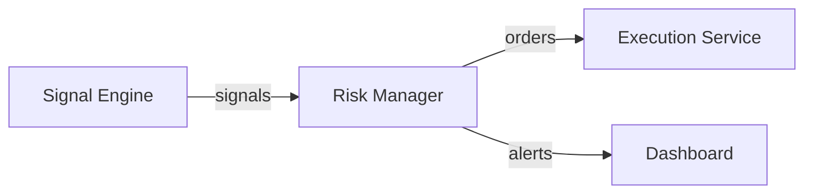

docker build -t cdb-risk-manager .
docker run -p 8002:8002 --env-file ../../.env cdb-risk-manager
# CDB Risk Manager

## 🚀 Überblick
Mehrlagiger Risikofilter, der Signale gegen Limits prüft, Orders freigibt oder
blockiert und Alerts auf das Topic `alerts` schreibt.

## 🧩 Architektur-Einordnung

- Eingehende Topics: `signals`
- Ausgehende Topics: `orders`, `alerts`
- Port/Endpoints: `8002` (`/health`, `/status`, `/metrics`)
- Abhängigkeiten: Redis (`cdb_redis`), Signal Engine (`cdb_signal`)



## ⚙️ Installation & Start

```powershell
docker compose build risk_manager
docker compose up -d risk_manager
curl http://localhost:8002/health
```

- Health-Endpoint: `http://localhost:8002/health`
- Metrics: `http://localhost:8002/metrics`

## 📊 Monitoring & Health

| Endpoint  | Beschreibung                      |
|-----------|-----------------------------------|
| `/health` | Alive-Check inkl. Timestamp        |
| `/status` | Aktive Limits, Circuit-Breaker     |
| `/metrics`| `risk_alert_total`, Exposure Gauge |

## 🧠 Logik / Features

- Validiert Signals anhand `MAX_POSITION_PCT`, `MAX_EXPOSURE_PCT`,
  `MAX_DAILY_DRAWDOWN_PCT`
- Circuit Breaker bei Drawdown oder Marktanomalien (Slippage, Datenstille)
- Order-Trimming: reduziert Positionsgröße statt kompletter Ablehnung
- Alerts je Level (`INFO`, `WARNING`, `CRITICAL`) auf Redis Topic `alerts`

## 🧾 Konfiguration

| Variable                 | Default | Beschreibung                      |
|--------------------------|---------|-----------------------------------|
| `MAX_POSITION_PCT`       | `0.10`  | Max. Kapital pro Trade            |
| `MAX_EXPOSURE_PCT`       | `0.50`  | Gesamt-Exposure Limit             |
| `MAX_DAILY_DRAWDOWN_PCT` | `0.05`  | Tagesverlust Limit                |
| `STOP_LOSS_PCT`          | `0.02`  | Stop-Loss pro Position            |
| `REDIS_HOST/PORT`        | `redis/6379` | Verbindung zum Bus            |

## 🧪 Tests & Validierung

```powershell
pytest backoffice/services/risk_manager/tests -q
redis-cli -a $REDIS_PASSWORD lrange alerts -5 -1
```

- Weitere Schritte: `backoffice/docs/Risikomanagement-Logik.md`

## 🪶 Lizenz & Credits

- Maintainer: Risk Team (Claire de Binaire Core Team)
- Status: ✅ Production Ready (v1.0)
