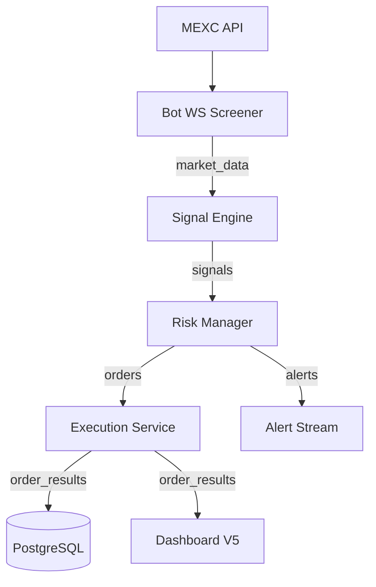
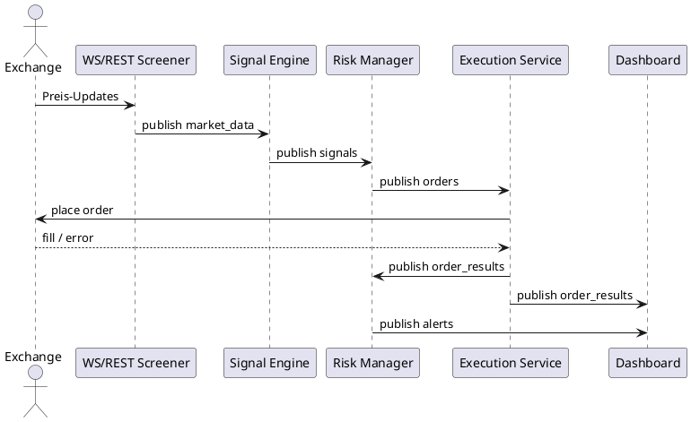

# ARCHITEKTUR.md — Claire de Binaire

**Ziel:** Autoritative Übersicht über Komponenten, Events, Ports und Konfiguration
für das Claire-de-Binaire-Ökosystem. Alle Angaben spiegeln den Stand der Docker-
Compose-Umgebung wider.

## 1️⃣ Systemübersicht

> **Card — Kernservices**
> - Bot Screener (WS/REST) für Marktdaten-Ingestion
> - Signal Engine für Momentum-Signale
> - Risk Manager mit mehrlagigem Schutzkonzept
> - Execution Service (Mock) für Orderdurchführung
> - Redis als Message-Bus, PostgreSQL als Persistenz, Prometheus+Grafana für
>   Monitoring

## 2️⃣ Events & Topics

| Topic            | Producer         | Consumer                   | Kurzbeschreibung        |
|------------------|------------------|----------------------------|-------------------------|
| `market_data`    | Bot WS/REST      | Signal Engine, Dashboard   | Candles, Ticker, Volume |
| `signals`        | Signal Engine    | Risk Manager               | Momentum-Signale        |
| `orders`         | Risk Manager     | Execution Service          | Freigegebene Orders     |
| `order_results`  | Execution Service| Risk, Dashboard, Persistenz| Fill-Status, Fees       |
| `alerts`         | Risk/Execution   | Dashboard, Logs            | Critical/Warning/Info   |
| `health`         | Alle Services    | Monitoring                 | Heartbeats, Payload OK  |

**Schema-Single-Source:** `backoffice/docs/EVENT_SCHEMA.json`

## 3️⃣ Services & Ports

| Service             | Container      | Port (Host→Container) | Health Endpoint            |
|---------------------|----------------|-----------------------|----------------------------|
| Redis               | `cdb_redis`    | `6380 → 6379`         | `redis-cli -a $PWD ping`   |
| PostgreSQL          | `cdb_postgres` | `5432 → 5432`         | `pg_isready -d claire_de_binare` |
| Prometheus          | `cdb_prometheus`| `9090 → 9090`        | `/-/healthy`               |
| Grafana             | `cdb_grafana`  | `3000 → 3000`         | `/api/health`              |
| Bot WS Screener     | `cdb_ws`       | `8000 → 8000`         | `/health`                  |
| Bot REST Screener   | `cdb_rest`     | `8080 → 8080`         | `/health` (periodisch)     |
| Signal Engine       | `cdb_signal`   | `8001 → 8001`         | `/health`, `/metrics`      |
| Risk Manager        | `cdb_risk`     | `8002 → 8002`         | `/health`, `/metrics`      |
| Execution Service   | `cdb_execution`| `8003 → 8003`         | `/health`, `/metrics`      |
| Signal Generator    | `cdb_signal_gen`| n/a                  | n/a (Worker)               |

Alle Container nutzen `restart: unless-stopped` sowie minimale Linux-Capabilities.

## 4️⃣ Konfiguration (ENV-Kernvariablen)

| Gruppe      | Schlüssel                  | Standard/Quelle | Verwendungszweck         |
|-------------|----------------------------|-----------------|--------------------------|
| Runtime     | `ENV`, `TZ`                | `.env`          | Laufzeitmodus, Zeitzone  |
| Screener    | `WS_SCREENER_PORT`,        | `.env`          | Exponierte Ports         |
|             | `REST_SCREENER_PORT`       |                 |                          |
| Signals     | `SYMBOL_WHITELIST`,        | `.env`          | Handelssymbole, Lookback |
|             | `LOOKBACK_MINUTES`,        |                 |                          |
|             | `INTERVAL`, `TOP_N`        |                 |                          |
| Risiko      | `MAX_POSITION_PCT`,        | `.env`          | Risk-Layer Schwellwerte  |
|             | `MAX_EXPOSURE_PCT`,        |                 |                          |
|             | `MAX_DAILY_DRAWDOWN_PCT`   |                 |                          |
| Infrastruktur| `REDIS_HOST`, `REDIS_PORT`,| `.env`         | Message-Bus Zugriff      |
|             | `POSTGRES_HOST`, `POSTGRES_DB`|               | Persistenz               |
| Secrets     | `MEXC_API_KEY`, `MEXC_API_SECRET`, `GRAFANA_PASSWORD`, `REDIS_PASSWORD` | `.env` (nicht einchecken) | Zugangsdaten |

Vor jedem Merge: `backoffice/automation/check_env.ps1` ausführen, damit keine
Duplikate oder fehlenden Secrets verbleiben.

## 5️⃣ Health & Observability

- Compose Healthchecks: einheitlich `curl -fsS http://localhost:PORT/health`
- Prometheus scrape: 15 Sekunden Intervall, Targets: Signal, Risk, Execution,
	Prometheus selbst
- Logs: zentral über `backoffice/logging_config.json` (JSON Strukturen)
- Alerts: `alerts` Topic, Anzeige im Dashboard V5 (Statusbar + Notifications)

## 6️⃣ Risikoprioritäten (Kurzfassung)

1. Tagesverlust (`MAX_DAILY_DRAWDOWN_PCT`) → Handel stoppen, Positionen schließen
2. Abnormale Marktbedingungen → Circuit Breaker, Alerts
3. Gesamt-Exposure (`MAX_EXPOSURE_PCT`) → neue Orders blockieren
4. Positionsgröße (`MAX_POSITION_PCT`) → Order trimmen oder ablehnen
5. Stop-Loss je Trade (`STOP_LOSS_PCT`) → automatischer Exit

Details: `backoffice/docs/Risikomanagement-Logik.md`

## 7️⃣ Sequenzdiagramm

## 8️⃣ Sicherheitsrichtlinien

- Secrets niemals commiten, nur `.env` lokal pflegen
- Container laufen ohne Root (`cap_drop: ALL`, `no-new-privileges:true`)
- Circuit Breaker bei Drawdown, Slippage > 1 %, Datenstille > 30 s
- Zugriff auf Grafana über Admin-Konto (Passwort in `.env`)

## 9️⃣ Referenzen & Validierungen

- `docker compose config --quiet`
- `curl http://localhost:8001/metrics` (Prometheus Format)
- `psql -h localhost -U admin -d claire_de_binare -c "\dt"`
- `README_GUIDE.md` für alle Readme-Anpassungen

---

*Letzte inhaltliche Prüfung:* 2025-11-01 • Verantwortlich: Repo-Kurator Claire de
Binaire
