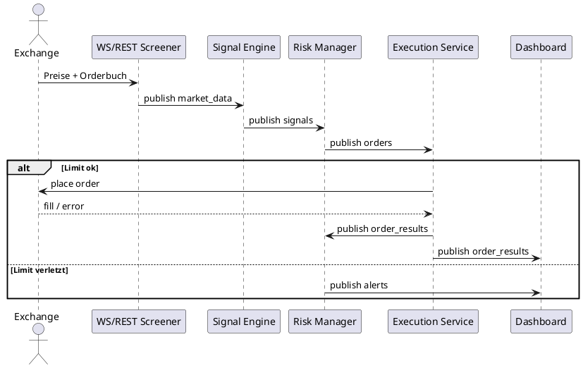

# Service-Kommunikation & Datenflüsse

## 1️⃣ Topics & Routing

| Topic           | Publisher           | Subscriber                 | Zweck                    |
|-----------------|---------------------|----------------------------|--------------------------|
| `market_data`   | Bot WS/REST         | Signal Engine, Dashboard   | Candles, Movers, Volume  |
| `signals`       | Signal Engine       | Risk Manager               | BUY/SELL Empfehlungen    |
| `orders`        | Risk Manager        | Execution Service          | Freigegebene Aufträge    |
| `order_results` | Execution Service   | Risk, Dashboard, Persistenz| Fill-Status, Fees        |
| `alerts`        | Risk/Execution      | Dashboard, Notifications   | Critical/Warning/Info    |
| `health`        | Alle Services       | Monitoring Stack           | Heartbeat + Meta         |

Payload-Definition: siehe `docs/EVENT_SCHEMA.json`.

## 2️⃣ Sequenzdiagramm



## 3️⃣ Microservice-Rollen

| Service            | Abonnements             | Publikationen           | Bemerkung                |
|--------------------|-------------------------|-------------------------|--------------------------|
| Bot WS Screener    | MEXC Streams            | `market_data`           | 1m Candles, Movers       |
| Signal Engine      | `market_data`           | `signals`               | Momentum/Volume Mix      |
| Risk Manager       | `signals`               | `orders`, `alerts`      | Mehrlagiges Risk-Layer   |
| Execution Service  | `orders`                | `order_results`         | Mock Execution + Persist |
| Dashboard          | `order_results`, `alerts`| UI & Status Cards      | Dashboard V5 Visuals     |
| Monitoring Stack   | `health`                | Alerts (extern)         | Prometheus, Alerting     |

Alle Services arbeiten asynchron (Pub/Sub). Keine direkte Service-zu-Service-
HTTP-Aufrufe jenseits der Health-/Status-Endpunkte.

## 4️⃣ Nachrichtenbeispiele

```jsonc
// market_data
{
  "type": "market_data",
  "symbol": "BTC_USDT",
  "timestamp": 1730443200000,
  "price": 35250.5,
  "volume": 184.12,
  "interval": "1m"
}

// signal
{
  "type": "signal",
  "symbol": "BTC_USDT",
  "side": "BUY",
  "confidence": 0.82,
  "reason": "Top mover + RSI oversold",
  "timestamp": 1730443260000
}

// order_result
{
  "type": "order_result",
  "order_id": "MOCK_123456",
  "status": "FILLED",
  "filled_quantity": 0.05,
  "price": 35260.1
}

// alert
{
  "type": "alert",
  "level": "CRITICAL",
  "code": "RISK_LIMIT",
  "message": "Daily drawdown reached. Trading halted.",
  "timestamp": 1730443280000
}
```

## 5️⃣ Resilienz & Fehlerpfade

- **Backoff & Retry:** Jeder Subscriber implementiert Exponential Backoff bei
  Redis-Verbindungsfehlern.
- **Idempotenz:** Orders erhalten deterministische IDs (`client_order_id`),
  damit Retries keine Doppel-Ausführungen erzeugen.
- **Circuit Breaker:** Risk Manager veröffentlicht `alerts` mit Level
  `CRITICAL`, wenn `MAX_DAILY_DRAWDOWN_PCT` überschritten wird; Execution
  ignoriert dann neue `orders`.
- **Monitoring:** `health` Topic ergänzt Docker-Healthchecks, Grafana Statusbar
  zeigt Ampel (grün/orange/rot).

## 6️⃣ Validierungsschritte

- `pwsh backoffice/automation/check_env.ps1`
- `docker compose logs signal_engine risk_manager execution_service`
- `redis-cli -a $REDIS_PASSWORD monitor` (temporär) zur Event-Nachverfolgung

## 7️⃣ Service-Port-Mapping

| Service              | Port (ENV)          |
|----------------------|---------------------|
| WebSocket Service    | `WS_PORT = 8000`    |
| Signal Engine        | `SIGNAL_PORT = 8001`|
| Risk Engine          | `RISK_PORT = 8002`  |
| Execution Service    | `EXEC_PORT = 8003`  |
| Prometheus           | `PROM_PORT = 9090`  |
| Grafana              | `GRAFANA_PORT = 3000`|
| Postgres             | `DB_PORT = 5432`    |
| Redis                | `REDIS_PORT = 6379` |

- Persistente Datenströme nutzen PostgreSQL (`POSTGRES_DB = claire_de_binare`).
- Redis stellt Queue/Cache-Funktionalität bereit und verlangt Authentifizierung (`REDIS_PASSWORD`).

---

Stand: 2025-11-02 • Verantwortlich: Repo-Kurator Claire de Binaire
