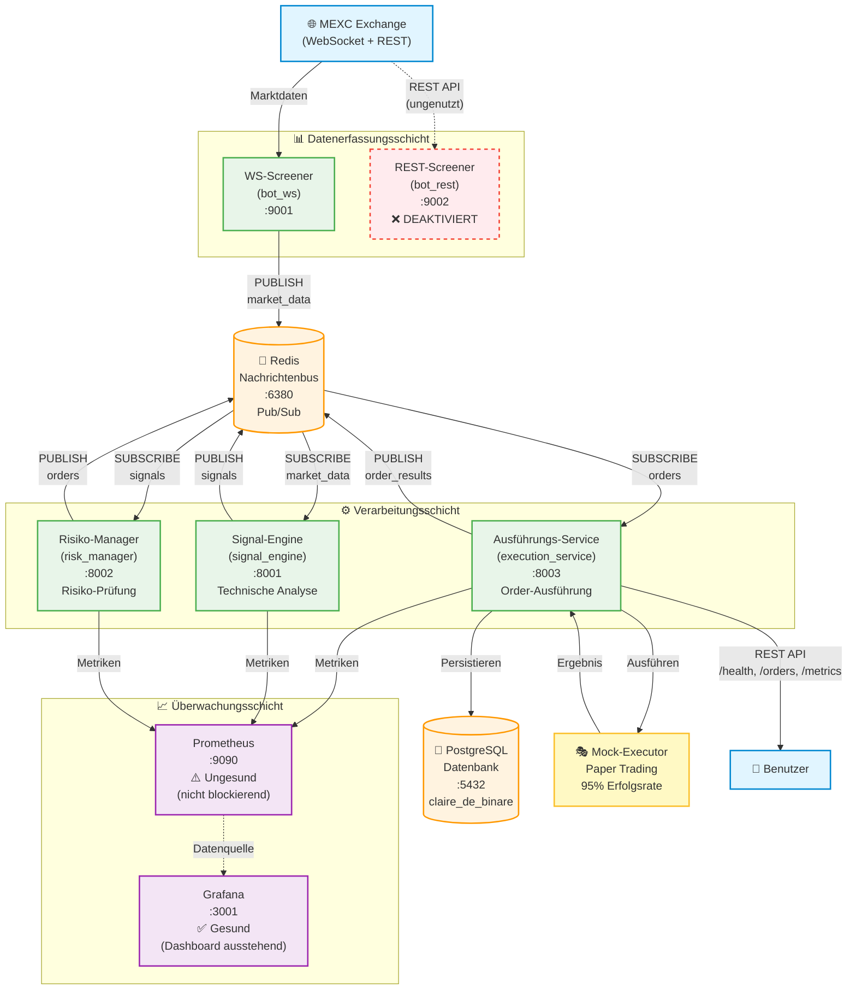
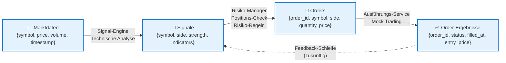
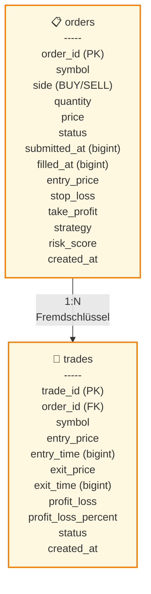
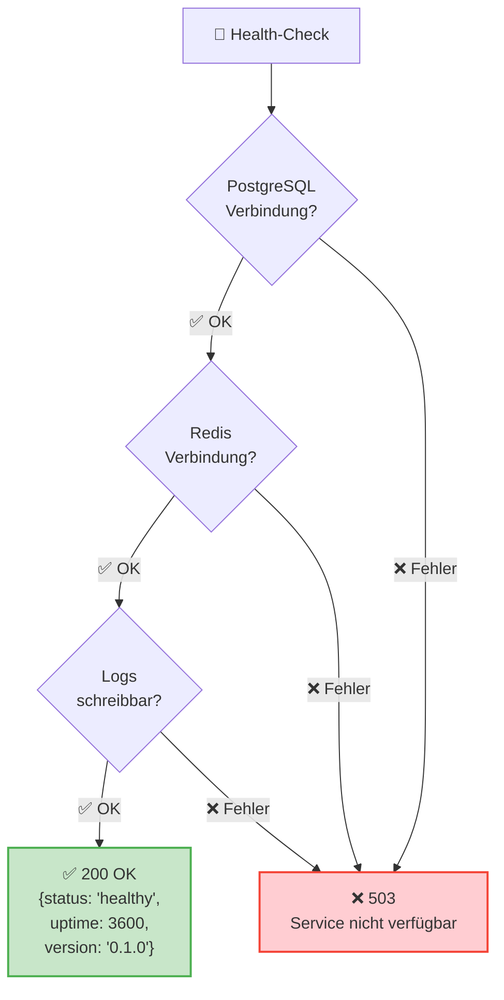
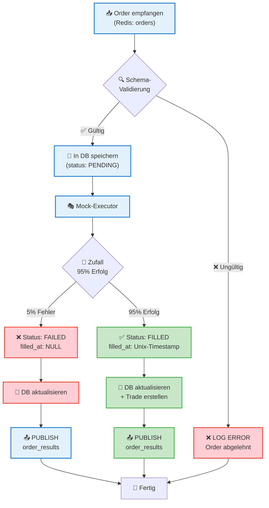
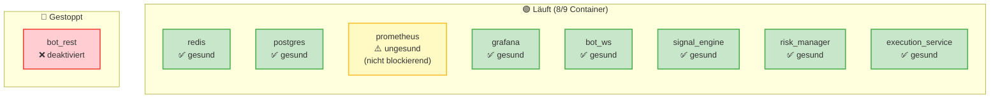

# Claire de Binaire – System-Flussdiagramm

**Letzte Aktualisierung:** 25. Oktober 2025  
**Status:** Phase 5 abgeschlossen, System produktionsbereit

---

## Gesamtarchitektur

---

## Event-Fluss im Detail

---

## Datenbank-Schema

---

## Health-Check Ablauf

---

## Order-Verarbeitungs-Pipeline

---

## Deployment-Status (Docker Compose)

## Stateful Komponenten

- PostgreSQL (`cdb_postgres_data`)
- Redis (`cdb_redis_data`)
- Prometheus (`cdb_prom_data`)
- Grafana (`cdb_grafana_data`)

Diese Komponenten sind für Backup und Restore relevant (vgl. Backupspezifikation / `MANIFEST_BACKUP.json`).

---

## Legende

| Symbol | Bedeutung |
|--------|-----------|
| 🌐 | Externe Datenquelle |
| 📊 | Datenerfassung |
| 🔴 | Nachrichtenbus (Redis) |
| ⚙️ | Verarbeitungs-Service |
| 🐘 | Datenbank (PostgreSQL) |
| 🎭 | Mock/Simulation |
| 📈 | Überwachung |
| ✅ | Gesund/Erfolgreich |
| ❌ | Fehler/Deaktiviert |
| ⚠️ | Warnung (nicht blockierend) |

---

## Nächste Schritte

1. **Grafana-Dashboard-Setup** (höchste Priorität)
2. **7-Tage Paper-Trading Test**
3. **Prometheus Health-Check Behebung** (optional)
4. **MEXC Testnet-Integration** (zukünftig)

---

**Dokumentiert:** 25. Oktober 2025  
**Agent:** GitHub Copilot  
**Projekt-Phase:** Phase 5 abgeschlossen (100% E2E-Tests erfolgreich)
