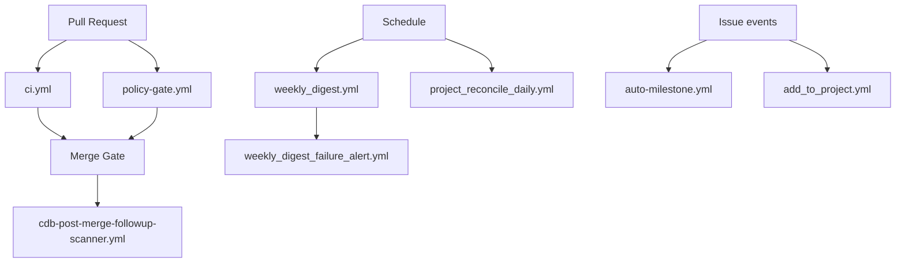

# GitHub Control Plane Graph

**Stand:** 2026-07-16  
**Scope:** aktive Workflow-Beziehungen; historische und entfernte Workflows sind ausgeschlossen.

## Zentrale Laufzeitbeziehungen

## Workflow-Run-Abhängigkeiten

| Downstream | Upstream | Kopplung |
|---|---|---|
| `weekly_digest_failure_alert.yml` | `weekly_digest.yml` | `workflow_run` |
| `auto-milestone-pr-apply.yml` | `auto-milestone-pr-intent.yml` | `workflow_run` |

Workflow-Namen in `workflow_run`-Filtern sind harte Schnittstellen. Eine
Umbenennung des Upstream-Workflows erfordert einen synchronen Contract-Test.

## Gemeinsame Support-Dateien

| Support-Datei | Verbraucher |
|---|---|
| `.github/prompts/cdb-control-followup.prompt.yml` | `cdb-control-followup-classifier.yml`, `cdb-post-merge-followup-scanner.yml` |
| `.github/scripts/advanced-emoji-filter.py` | `emoji-filter.yml`, `emoji-bot.yml` |
| `.github/workflows/labels.json` | `sync-labels.yml`, `label-bootstrap.yml` |

## Schreibende Hauptflächen

| Oberfläche | Workflows |
|---|---|
| Issues/Kommentare | `cdb-daily-delta-triage.yml`, `cdb-weekly-control-hygiene-classifier.yml`, `cdb-post-merge-followup-scanner.yml`, `smart-insights.yml` |
| Project Board | `control_board_upsert.yml`, `project_reconcile_daily.yml`, `add_to_project.yml` |
| Labels/Milestones | `sync-labels.yml`, `auto-milestone.yml`, `auto-milestone-label-dispatch.yml`, `project_status_label_map.yml`, `milestone_stage_label_sync.yml` |
| Security-Ergebnisse | `gitleaks.yml`, `trivy.yml`, `security-scan.yml`, `codeql-python.yml` |
| Container Registry | `docker-publish.yml` |

## Entfernte Pfade

Am 2026-07-16 wurden 13 ungenutzte Workflow-Dateien einschließlich der
unerreichbaren Gemini-Kette, alter Label-/Milestone-Automation, geparkter
Board-Router und der eingefrorenen Parallel-CI entfernt. Es existiert kein
Fallback- oder Stub-Pfad für diese Dateien.
