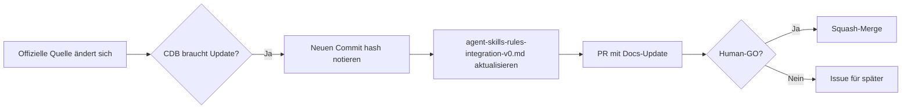

# SurrealDB Agent Skills / Rules Integration v0

**Status:** Read-only Reference + Mapping
**Stand:** 2026-06-25
**Scope:** Offizielle SurrealDB Agent Skills und Agent Rules als CDB-kompatible Referenzfläche.

## Purpose

Dieses Dokument definiert, wie CDB-Agenten offizielle SurrealDB Agent Skills und Agent Rules
referenzieren und nutzen — ohne sie zu forken, zu kopieren oder zu verändern.

## Offizielle Quellen

### SurrealDB Agent Skills

| Quelle | Commit | Letztes Update | Pfad |
|--------|--------|----------------|------|
| https://github.com/surrealdb/agent-skills | `95628976` | 2026-06-16 | `skills/` |

8 offizielle Skills:

| Skill | Zweck | Für CDB relevant bei |
|-------|-------|----------------------|
| `surrealql` | Core SurrealQL-Syntax, Schema, Graph-Relationships, Best Practices | Schema-Arbeit, Queries, Graph-Traversals |
| `surrealql-performance` | Performance-Optimierung: Record-IDs, Index-Strategie, Computed Fields | Index-Design, Query-Tuning |
| `surrealql-functions` | Built-in SurrealQL-Funktionen (LSP, Signaturen) | SurrealQL-Entwicklung |
| `surrealkit` | SurrealKit CLI: Schema-Management, Sync, Rollout, TypeGen, Tests | Schema-Änderungen, Deployment |
| `surrealdb-vector` | HNSW Vector Indexes, KNN Queries, Similarity Scoring | Vector-Search, RAG, Embeddings |
| `surrealdb-python` | SurrealDB Python SDK (WebSocket + Embedded) | Python-Integration, MCP-Server |
| `surrealdb-js` | SurrealDB JavaScript/TypeScript SDK | Node.js/Web-Integration |
| `surrealdb-cli` | `surreal` Command-Line Binary | Server-Management, Backup, Export |

### SurrealDB Agent Memory

| Quelle | Commit | Letztes Update |
|--------|--------|----------------|
| https://github.com/surrealdb/agent-memory | `32a90a4c` | 2026-03-26 |

Framework-Beispiele: Agno, LangChain, LangGraph, Pydantic AI.

### SurrealDB Agent Rules (`.mdc`)

| Quelle | Commit | Letztes Update | Pfad |
|--------|--------|----------------|------|
| https://github.com/surrealdb/docs.surrealdb.com | `a69077df` | 2026-01-16 | `public/integrations/agent-rules/` |

4 Rule-Dateien:

| Rule | Inhalt |
|------|--------|
| `surrealql.mdc` | SurrealQL Record-IDs, Update-Modi, Relationships, Schema-Definition, Live-Queries |
| `surrealdb-vector.mdc` | HNSW-Index-Definition, KNN-Queries, Scoring |
| `surrealdb-python.mdc` | Python SDK-Verbindung, CRUD, SurrealQL-Query |
| `surrealdb-python-embedded.mdc` | SurrealDB Embedded-Mode in Python |

## CDB Mapping

| Offizielle Quelle | CDB-Surface | CDB-Skill/File | Mapping-Typ |
|-------------------|-------------|----------------|-------------|
| surrealdb/agent-skills | `.opencode/skills/cdb-external-docs/` | SKILL.md → Lookup-Kategorie | Referenz |
| surrealdb/agent-skills | `.cursor/skills/cdb-external-docs/` | SKILL.md → Lookup-Kategorie | Referenz |
| surrealdb/agent-skills | `.claude/skills/cdb-external-docs/` | SKILL.md → Lookup-Kategorie | Referenz |
| surrealdb/agent-skills | `.codex/cdb_skills/cdb-external-docs/` | SKILL.md → Lookup-Kategorie | Referenz |
| surrealdb/agent-skills | `.gemini/skills/cdb-external-docs/` | SKILL.md → Lookup-Kategorie | Referenz |
| SurrealDB Agent Rules | `docs/external-docs/index.md` | SurrealDB-Eintrag | Referenz |
| SurrealDB Agent Rules | `docs/surrealdb/agent-skills-rules-integration-v0.md` | Mapping-Dokument | Mapping |
| SurrealDB Docs | `docs/external-docs/index.md` | SurrealDB (`required` Priority) | Referenz |

## SurrealDB Documentation Gate

Jeder CDB-Agent MUSS bei SurrealDB-relevanten Aufgaben:

1. **Offizielle Doku bevorzugen** — `https://surrealdb.com/docs` ist die SSOT für Syntax,
   Signatures, Limits und Behaviour.
2. **Agent Skills nutzen** — Die offiziellen SurrealDB Agent Skills (`surrealdb/agent-skills`)
   enthalten die autoritative Kurzreferenz für SurrealQL, Vector-Suche, SDKs und CLI.
3. **Agent Rules respektieren** — Die `.mdc`-Rules aus `surrealdb/docs.surrealdb.com`
   definieren idiomatische Patterns (Record-IDs, HNSW, SDK-Usage).
4. **Nicht aus Erinnerung raten** — SurrealQL unterscheidet sich fundamental von ANSI-SQL.
   Ohne Doku-Zugriff: `HOLD_SYNTAX_UNVERIFIED` melden.
5. **Nicht fork-en** — Keine lokale Kopie der offiziellen SurrealDB Skills/Rules einchecken.
   Referenz + Sync-Manifest reicht.
6. **Read-only-first** — Alle SurrealDB-Zugriffe aus CDB-Agenten sind read-only.
   Produktive DB-Writes brauchen expliziten Human-GO.

## Aktualisierungs-Workflow



Regeln:
- **Kein automatisches Live-Update** ohne Human-GO.
- **Source-Manifest** (dieses Dokument) enthält Commit-Hashes zum Drift-Vergleich.
- **Kein Vendor/Clone** der offiziellen Skills ins Working Repo.
- **Änderungen an offiziellen Skills**: separat im Issue #3425 tracken.

## Safety Boundaries

| Grenze | Status |
|--------|--------|
| Fork von surrealdb/agent-skills | VERBOTEN |
| Fork von surrealdb/agent-memory | VERBOTEN |
| Mutation offizieller Skills | VERBOTEN |
| Produktive DB-Writes | VERBOTEN (Human-GO nötig) |
| Live-Schema-Sync | VERBOTEN |
| MCP-Mutation | VERBOTEN |
| Runtime/Docker-Änderung | VERBOTEN |
| Secrets/Tokens in Docs | VERBOTEN |
| Root-Token-Erstellung | VERBOTEN |

## Source Manifest

```yaml
sources:
  agent_skills:
    repo: surrealdb/agent-skills
    commit: 95628976
    checked_at: 2026-06-25
    skills_count: 8
    skill_names:
      - surrealql
      - surrealql-performance
      - surrealql-functions
      - surrealkit
      - surrealdb-vector
      - surrealdb-python
      - surrealdb-js
      - surrealdb-cli
  agent_memory:
    repo: surrealdb/agent-memory
    commit: 32a90a4c
    checked_at: 2026-06-25
  agent_rules:
    repo: surrealdb/docs.surrealdb.com
    commit: a69077df
    path: public/integrations/agent-rules/
    checked_at: 2026-06-25
    rules:
      - surrealql.mdc
      - surrealdb-vector.mdc
      - surrealdb-python.mdc
      - surrealdb-python-embedded.mdc
```

## Verknüpfte CDB-Dokumente

| Dokument | Zweck |
|----------|-------|
| `docs/external-docs/index.md` | Zentrale externe Doc-Referenz |
| `docs/surrealdb/README.md` | SurrealDB / Context Intelligence Übersicht |
| `.opencode/skills/cdb-external-docs/SKILL.md` | External-Docs-Lookup-Skill (OpenCode) |
| `.cursor/skills/cdb-external-docs/SKILL.md` | External-Docs-Lookup-Skill (Cursor) |
| `.claude/skills/cdb-external-docs/SKILL.md` | External-Docs-Lookup-Skill (Claude Code) |
| `.codex/cdb_skills/cdb-external-docs/SKILL.md` | External-Docs-Lookup-Skill (Codex) |
| `.gemini/skills/cdb-external-docs/SKILL.md` | External-Docs-Lookup-Skill (Gemini) |

## Nächster Slice

**#3427 — ContextBrain Report / Gist Ledger Integration**

Dieser Slice ist als nächstes fällig. Er baut auf der Permission Matrix (#3426) auf
und integriert den ContextBrain-Ledger-Report.
