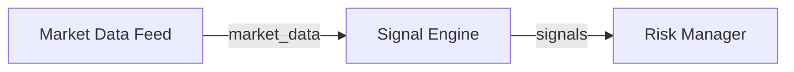

docker compose build signal_engine
docker compose --profile dev up -d signal_engine
# CDB Signal Engine

## 🚀 Überblick
Event-getriebener Microservice, der Momentum-Signale aus Live-Marktdaten
generiert und auf das Redis-Topic `signals` publiziert.

## 🧩 Architektur-Einordnung

- Eingehende Topics: `market_data`
- Ausgehende Topics: `signals`
- Port/Endpoints: `8001` (`/health`, `/status`, `/metrics`)
- Abhängigkeiten: Redis (`cdb_redis`)



## ⚙️ Installation & Start

```powershell
docker compose build signal_engine
docker compose up -d signal_engine
curl http://localhost:8001/health
```

- Health-Endpoint: `http://localhost:8001/health`
- Metrics: `http://localhost:8001/metrics` (Prometheus Format)

## 📊 Monitoring & Health

| Endpoint  | Beschreibung                |
|-----------|-----------------------------|
| `/health` | JSON Status mit Timestamp   |
| `/status` | Letztes Signal, Queue-Status|
| `/metrics`| `signals_generated_total`, Latenzen |

## 🧠 Logik / Features

- Top-Mover Analyse (`TOP_N`, `LOOKBACK_MINUTES` aus `.env`)
- Momentum-Score (prozentuale Veränderung, Volumenfilter)
- Konfigurierbare Mindestliquidität (`SIGNAL_MIN_VOLUME`, optional)
- Glitch-Schutz: Idle-Timeout → Warnung auf `alerts` Topic (geplant)

## 🧾 Konfiguration

| Variable               | Default | Beschreibung                    |
|------------------------|---------|---------------------------------|
| `LOOKBACK_MINUTES`     | `15`    | Candlestick-Fenster             |
| `TOP_N`                | `5`     | Anzahl beobachteter Symbole     |
| `SYMBOL_WHITELIST`     | `.env`  | Override für Symbolauswahl      |
| `MAX_POSITION_PCT`     | `.env`  | Limit, das an Risk weitergereicht wird |
| `REDIS_HOST/PORT`      | `redis/6379` | Pub/Sub Verbindung         |

## 🧪 Tests & Validierung

```powershell
pytest backoffice/services/signal_engine/tests -q
redis-cli -a $REDIS_PASSWORD monitor  # kurzfristig zum Trace
```

- Verweis auf `backoffice/docs/END_TO_END_TEST_GUIDE.md`

## 🪶 Lizenz & Credits

- Maintainer: Signal Squad (Claire de Binare Core Team)
- Nutzung intern, Source proprietär
